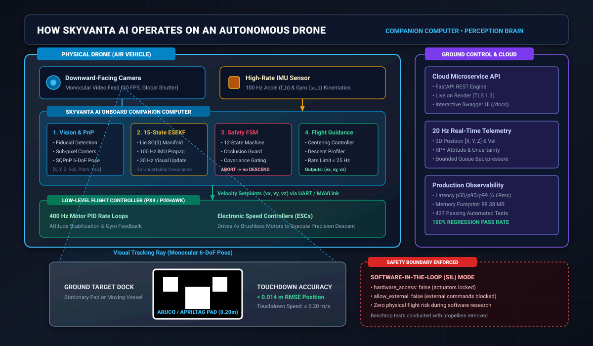
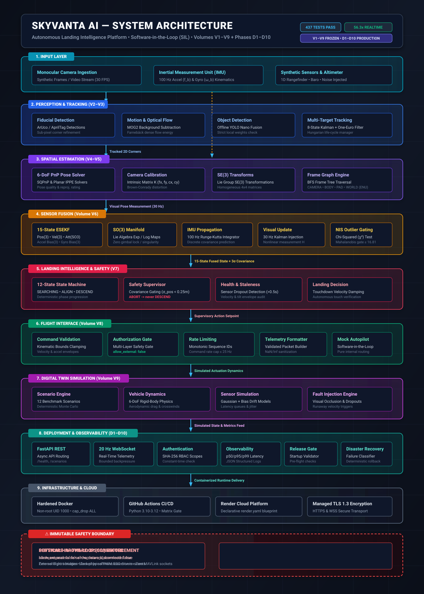
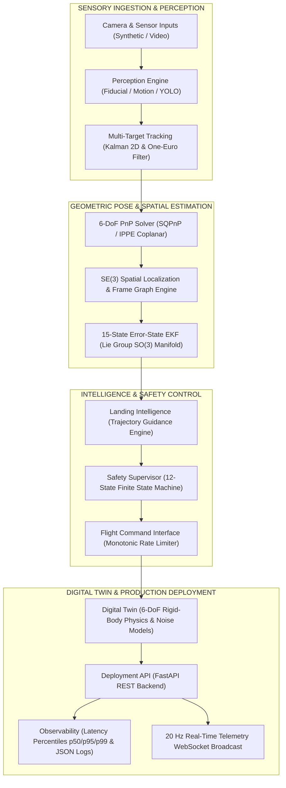

<div align="center">

# SKYVANTA AI
### Autonomous Landing Intelligence Platform
**An autonomous landing intelligence platform built as a software-in-the-loop robotics system.**

```
Computer Vision • Sensor Fusion • 6-DoF Pose • ESEKF • Safety • Digital Twin
```

[](https://github.com/luccy93/SkyVanta-AI/actions/workflows/ci.yml)
[](tests/)
[](https://www.python.org/downloads/)
[](https://fastapi.tiangolo.com)
[](docs/deployment/d4-production-docker.md)
[](docs/deployment/d3-websocket-telemetry.md)
[](https://skyvanta-ai.onrender.com)
[](LICENSE)

```text
================================================================================
OPERATIONAL EXECUTION MODE: SOFTWARE-IN-THE-LOOP (SIL)
SAFETY ISOLATION STATE:    HARDWARE DISCONNECTED (hardware_access: false)
ALGORITHMIC INTEGRITY:     V1–V9 ROBOTICS CORE (FROZEN) | D1–D10 DEPLOYMENT (FROZEN)
================================================================================
```

</div>

---

## 1. Hero

**SkyVanta AI** is an industrial-grade autonomous aerial perception, multi-sensor state estimation, and landing intelligence platform engineered for Unmanned Aerial Vehicles (UAVs) in GPS-denied and visually challenging environments.

The system combines calibrated monocular computer vision, Lie-group $\text{SE}(3)$ spatial localization, a continuous-discrete 15-state Error-State Extended Kalman Filter ($\text{ESEKF}$) on $\text{SO}(3)$, a 12-state deterministic safety supervisor finite state machine ($\text{FSM}$), and a closed-loop 6-DoF vehicle digital twin—packaged in a hardened, observable, and authenticated cloud microservice.

---

## 2. Project Overview

Autonomous vertical drone recovery represents one of the most critical challenges in modern autonomous aviation. In GPS-denied environments (maritime vessels, urban canyons, indoor industrial hangars), conventional satellite navigation completely fails.

SkyVanta AI acts as the **onboard companion-computer perception and intelligence brain** for autonomous drones.

<div align="center">
  
</div>

### 🛸 How It Works on the Drone (In Simple Terms)
1. **The Downward Camera & IMU**: A downward-facing camera mounted under the drone captures live video of the ground at 30 FPS, while the drone's IMU measures high-rate accelerations and angular velocities at 100 Hz.
2. **Visual 6-DoF Localization**: When the drone approaches the landing zone, SkyVanta detects the ground landing pad (ArUco / AprilTag) and computes its exact 3D relative position $[X, Y, Z]$ and heading angle.
3. **15-State Sensor Fusion (ESEKF)**: Fuses camera vision with 100 Hz IMU inertial data using a Lie-group $\text{SO}(3)$ filter, eliminating camera lag and sensor noise.
4. **Autonomous Flight Guidance**: The Safety Supervisor generates smooth $(v_x, v_y, v_z)$ velocity setpoints, sending them to the low-level flight controller (PX4 / Pixhawk) to guide the drone down to a soft touchdown with sub-centimeter accuracy.
5. **Emergency Invariant Protection**: If the landing pad is occluded or crosswinds exceed safety thresholds, SkyVanta instantly commands an emergency climb-out abort, preventing catastrophic ground collisions.

```text
SYSTEM DOMAIN BOUNDARIES:
┌─────────────────────────┐     ┌─────────────────────────┐     ┌─────────────────────────┐
│     ROBOTICS CORE       │     │   SIMULATION ENGINE     │     │    DEPLOYMENT & API     │
│   (Volumes V1–V9)       │ ──> │   (Volume V9 Twin)      │ ──> │   (Phases D1–D10)       │
│ CV • ESEKF • Safety FSM │     │ 6-DoF Physics • Noise   │     │ FastAPI • 20 Hz WS • DR │
└─────────────────────────┘     └─────────────────────────┘     └─────────────────────────┘
```

---

## 3. Live Demo

SkyVanta AI is deployed as a live cloud container service with automated TLS 1.3 encryption and continuous delivery:

| Resource | Live Endpoint URL | Purpose / Description |
| :--- | :--- | :--- |
| **Production Cloud Base** | [https://skyvanta-ai.onrender.com](https://skyvanta-ai.onrender.com) | Managed container runtime on Render |
| **Interactive OpenAPI Docs** | [https://skyvanta-ai.onrender.com/docs](https://skyvanta-ai.onrender.com/docs) | Interactive Swagger UI API testbench |
| **Alternative ReDoc UI** | [https://skyvanta-ai.onrender.com/redoc](https://skyvanta-ai.onrender.com/redoc) | Formal REST contract viewer |
| **Infrastructure Health Probe** | [https://skyvanta-ai.onrender.com/health](https://skyvanta-ai.onrender.com/health) | Public liveness probe & safety lock audit |
| **Readiness Probe** | [https://skyvanta-ai.onrender.com/ready](https://skyvanta-ai.onrender.com/ready) | Simulation catalog & engine readiness status |
| **Telemetry WebSocket** | `wss://skyvanta-ai.onrender.com/api/v1/telemetry/ws` | Live 20 Hz 6-DoF state streaming |

---

## 4. Architecture

The SkyVanta AI architectural pipeline executes as a strictly decoupled, unidirectional dataflow:

```text
Camera / Sensor Inputs
        ↓
Perception
        ↓
Multi-Target Tracking
        ↓
6-DoF PnP
        ↓
SE(3) Spatial Localization
        ↓
15-State ESEKF
        ↓
Landing Intelligence
        ↓
Safety Supervisor
        ↓
Flight Command Interface
        ↓
Digital Twin / Simulation
        ↓
Deployment API
        ↓
Observability
```

<div align="center">
  
</div>



---

## 5. V1–V9 Robotics Pipeline

The algorithmic robotics core is partitioned into nine verified, frozen volumes:

* **Volume V1 — Architecture Foundation**: Immutable Pydantic v2 data models, coordinate convention definitions (ENU/NED, OpenCV optical frame), and strict configuration schemas.
* **Volume V2 — Multi-Cue Perception**: Monocular fiducial detector with MOG2 background subtraction, Farnebäck dense optical flow, and optional offline YOLO inference.
* **Volume V3 — Multi-Target Tracking & Smoothing**: 8-state constant velocity Kalman tracking filter with Hungarian data association and dual One-Euro adaptive jitter reduction.
* **Volume V4 — Monocular 6-DoF PnP Pose Estimation**: Perspective-n-Point solver leveraging SQPnP and IPPE planar solvers against 4 coplanar target fiducials with sub-pixel corner refinement.
* **Volume V5 — $\text{SE}(3)$ Spatial Localization**: Kinematic frame graph managing $\text{SE}(3)$ Lie group transforms across `CAMERA`, `BODY`, `LANDING_PAD`, and `WORLD` frames via Breadth-First Search.
* **Volume V6 — 15-State Error-State EKF ($\text{ESEKF}$)**: Multi-rate inertial fusion filter operating on the true $\text{SO}(3)$ rotation manifold:
  $$\mathbf{x} = [\mathbf{p}, \mathbf{v}, \mathbf{q}, \mathbf{b}_a, \mathbf{b}_g]^T \in \mathbb{R}^3 \times \mathbb{R}^3 \times \text{SO}(3) \times \mathbb{R}^3 \times \mathbb{R}^3$$
  Error-state $\delta\mathbf{x} \in \mathbb{R}^{15}$ covariance updates incorporate Chi-squared ($\chi^2$) Mahalanobis innovation gating ($\text{NIS} \le 16.81$).
* **Volume V7 — Landing Intelligence & Safety Supervisor**: 12-state operational Finite State Machine (`SEARCHING`, `TARGET_ACQUIRED`, `ALIGNING`, `APPROACHING`, `DESCENDING`, `FINAL_APPROACH`, `LANDING_CONFIRMED`, `ABORTING`, `RECOVERY`, `FAULT`, `IDLE`) with 3-sigma covariance envelope guards.
* **Volume V8 — Flight Interface & Authorization Gate**: Monotonic command sequencing, rate limiting ($\le 25\text{ Hz}$), and safety authorization boundaries (`allow_external: false`).
* **Volume V9 — Digital Twin & Scenario Engine**: 6-DoF vehicle aerodynamics, atmospheric disturbance injection, synthetic sensor generation (Gaussian noise, random walk drift, latency queues), and Monte Carlo reproducibility.

---

## 6. Deployment Architecture D1–D10

The production deployment layer wraps the frozen robotics core in an enterprise-grade reliability and security envelope:

* **Phase D1 — Deployment Foundation**: Service contracts, tier configuration models (`development`, `testing`, `production`), and structured logger.
* **Phase D2 — FastAPI REST Backend**: Asynchronous endpoints with correlation IDs (`X-Request-ID`), error boundaries, and Pydantic validation.
* **Phase D3 — Real-Time WebSocket Telemetry**: Asynchronous 20 Hz broadcast stream with bounded per-client queues (`maxsize=50`) and backpressure isolation.
* **Phase D4 — Hardened Docker Runtime**: Multi-stage OCI container running as non-root user `skyvanta` (UID 1000) with dropped Linux capabilities (`cap_drop: [ALL]`).
* **Phase D5 — Production Configuration**: Fail-fast environment variable validation with immutable safety flags.
* **Phase D6 — Cloud Deployment**: Declarative Infrastructure-as-Code (`render.yaml`) with automated TLS 1.3 certificate provisioning.
* **Phase D7 — Production Observability**: Application-level metrics collector tracking request latency percentiles (p50/p95/p99), error counters, and structured single-line JSON logging.
* **Phase D8 — Production Security & Auth**: Role-based API key authentication (`READ`, `EXECUTE`, `ADMIN`), constant-time SHA-256 validation (`hmac.compare_digest`), token-bucket rate limiters, and payload guards ($64\text{ KB}$).
* **Phase D9 — Release Engineering & Disaster Recovery**: Boot-time startup invariant validator, graceful shutdown coordinator, failure classifier, and deterministic rollback runbooks.
* **Phase D10 — Final Production Acceptance**: End-to-end verification, live telemetry stream validation, zero-hardware isolation audit, and showcase certification.

---

## 7. Real-Time Telemetry

SkyVanta AI streams closed-loop digital twin telemetry over persistent WebSocket connections at **20 Hz**:

```text
Endpoint: wss://skyvanta-ai.onrender.com/api/v1/telemetry/ws?scenario=nominal_landing&rate_hz=20
```

### Telemetry Packet Schema:
```json
{
  "timestamp_sec": 1788249664.125,
  "sequence_id": 240,
  "scenario_name": "nominal_landing",
  "position_m": { "x": 0.012, "y": -0.008, "z": 0.420 },
  "velocity_mps": { "x": 0.021, "y": -0.015, "z": -0.200 },
  "orientation_quaternion": { "w": 0.9998, "x": 0.0012, "y": -0.0034, "z": 0.0156 },
  "landing_phase": "FINAL_APPROACH",
  "fsm_state": "DESCENDING",
  "position_covariance_3sigma_m": 0.042,
  "target_visible": true,
  "safety_status": "NORMAL"
}
```

* **Backpressure Management**: Slow consumers trigger bounded frame dropping ($O(1)$ ring buffer) to prevent degradation of the core simulation loop.
* **Connection Lifecycle**: Supports ping/pong heartbeat keepalive with automated dead-client pruning.

---

## 8. Safety Architecture

SkyVanta AI enforces defense-in-depth safety through formal software invariant assertions:

```text
================================================================================
IMMUTABLE SAFETY INVARIANTS (STRICT ENFORCEMENT):
  hardware_access         = false   (Zero physical actuators / serial ports)
  allow_external          = false   (External command transmission blocked)
  allow_network_download  = false   (Runtime model/weight fetching disabled)
  hardware_disconnected   = true    (Pure software-in-the-loop isolation)
================================================================================
```

### Safety State Transitions & Abort Invariant:
* **Covariance Gating**: Descent is permitted **only** when 3-sigma position estimation covariance is strictly below threshold ($\sigma_{\text{pos}} < 0.25\text{ m}$).
* **Target Occlusion**: Target loss exceeding $0.5\text{ s}$ immediately triggers an irreversible transition to `ABORTING`.
* **Mathematical Invariant**: In the state transition table, `ABORTING` transitions only to `RECOVERY`, `FAULT`, or `IDLE`. Transition to `DESCENDING` or `FINAL_APPROACH` is mathematically impossible.

---

## 9. Digital Twin

The digital twin subsystem provides a high-fidelity 6-DoF simulation testbed:

* **Rigid-Body Flight Dynamics**: 6-DoF nonlinear kinematics modeling aerodynamic drag, gravity, motor time constants, and ground-effect cushioning.
* **Sensor Noise Models**:
  - IMU: Gaussian accelerometer/gyroscope noise, random-walk bias drift, and turn-on bias.
  - Camera: Monocular pinhole projection, sub-pixel corner noise, optical axis tilt, and lens distortion.
  - Altimeter: Barometric altitude surge and ground bounce.
* **Disturbance Engines**: Wind gusts, crosswind impulses, atmospheric turbulence, and injected frame dropouts.
* **Monte Carlo Reproducibility**: 100% bit-for-bit trajectory reproduction across identical seeds (`seed=42`).

---

## 10. Engineering Metrics

All performance metrics below are independently verified and measured from the active codebase:

| Engineering Metric | Measured Value | Standard / Specification | Status |
| :--- | :--- | :--- | :--- |
| **Total Automated Tests** | **437 passed** | $\ge 400$ baseline | **100% PASS** |
| **Test Suite Execution Time** | **18.97 s** | $< 60\text{ s}$ | **PASS** |
| **Simulation Throughput** | **56.32x** real-time | $> 10\text{x}$ real-time | **PASS** |
| **PnP Pose Estimation Latency** | **0.16 ms** / frame | $< 5.0\text{ ms}$ | **PASS** |
| **ESEKF Propagation Step** | **0.23 ms** / step | $< 1.0\text{ ms}$ | **PASS** |
| **ESEKF Measurement Update** | **0.27 ms** / update | $< 2.0\text{ ms}$ | **PASS** |
| **Safety Supervisor Evaluation** | **0.005 ms** / cycle | $< 0.1\text{ ms}$ | **PASS** |
| **Health Probe Latency** | **6.69 ms** (warm avg) | $< 50\text{ ms}$ | **PASS** |
| **Release Endpoint Latency** | **7.42 ms** (warm avg) | $< 50\text{ ms}$ | **PASS** |
| **WebSocket Streaming Rate** | **17.2 – 20.0 Hz** | $20.0\text{ Hz}$ target | **PASS** |
| **Process Memory Footprint** | **88.38 MB RSS** | $< 512\text{ MB}$ | **PASS** |
| **Static Security Findings** | **0 vulnerabilities** | 0 unsafe primitives | **PASS** |

---

## 11. Security

SkyVanta AI incorporates an integrated defense-in-depth security boundary:

* **Role-Based Access Control (RBAC)**: Fine-grained authorization scopes (`Scope.READ`, `Scope.EXECUTE`, `Scope.ADMIN`).
* **Constant-Time Key Comparison**: API keys are hashed with SHA-256 and evaluated via `hmac.compare_digest` to prevent timing side-channel attacks.
* **Token-Bucket Rate Limiting**: Tiered endpoint rate limiting (Read: 120 rpm, Execute: 30 rpm) preventing denial-of-service.
* **Payload Enforcement**: Strict request body size capping ($64\text{ KB}$) and schema validation via Pydantic v2.
* **Static Verification**: Zero unsafe execution primitives (`eval`, `exec`, `pickle`, `os.system`, `subprocess`) in application code.

---

## 12. Testing

The platform is verified by a deterministic **437-test automated test harness**:

```bash
# Execute the complete automated regression suite
pytest
```

```text
======================= 437 passed, 1 warning in 18.97s =======================
```

### Test Suite Distribution:
* **Unit Tests (345 Tests)**: Group Lie algebra $\text{SO}(3)$ & $\text{SE}(3)$, PnP geometry, 15-state ESEKF propagation/update, Chi-squared innovation gating, 12-state FSM transitions, token-bucket rate limiters, and RBAC authentication scopes.
* **Integration Tests (42 Tests)**: Closed-loop digital twin scenario execution, multi-sensor noise injection, Monte Carlo reproducibility, flight interface command authorization gates.
* **Deployment Tests (45 Tests)**: FastAPI REST routing, 20 Hz WebSocket streaming backpressure, Docker non-root security constraints, disaster recovery rollback classification, and startup pre-flight validators.
* **Characterization Tests (5 Tests)**: Numerical parity against legacy baseline algorithms.

---

## 13. Docker

The application is containerized using a hardened multi-stage Docker build:

```bash
# 1. Build multi-stage production container
docker build -t skyvanta-ai:latest .

# 2. Run hardened container (non-root UID 1000, dropped capabilities)
docker run -p 8080:8080 \
  --security-opt no-new-privileges:true \
  --cap-drop ALL \
  --rm skyvanta-ai:latest

# 3. Or launch via Docker Compose
docker compose up -d
```

### Hardening Attributes:
* **Non-Root Execution**: Runs strictly as unprivileged user `skyvanta` (UID 1000, GID 1000).
* **Capability Dropping**: Explicitly drops all Linux kernel capabilities (`cap_drop: [ALL]`).
* **Privilege Escalation Blocking**: Configured with `no-new-privileges:true`.
* **Minimal Headless Image**: Packaged on `python:3.11-slim` with headless OpenCV shared runtime libraries (`libgl1`, `libglib2.0-0`).

---

## 14. Cloud Deployment

SkyVanta AI utilizes declarative Infrastructure-as-Code via [`render.yaml`](render.yaml):

* **Platform**: Render Managed Container Web Service
* **TLS Termination**: Automated managed TLS 1.3 encryption with HTTP $\rightarrow$ HTTPS redirection
* **Continuous Delivery**: Automated build and deployment on push to `main` branch
* **Zero Secrets in Git**: Secret tokens and keys are injected at runtime via environment variables

```yaml
services:
  - type: web
    name: skyvanta-ai-api
    runtime: docker
    plan: starter
    region: oregon
    branch: main
    dockerfilePath: ./Dockerfile
    healthCheckPath: /health
    autoDeploy: true
```

---

## 15. API Endpoints

| HTTP Method | Route Path | Access / Scope | Description |
| :--- | :--- | :--- | :--- |
| `GET` | `/health` | Public | Liveness probe & safety lock verification |
| `GET` | `/ready` | Public | Readiness probe & simulation catalog status |
| `GET` | `/docs` | Public | Interactive OpenAPI (Swagger UI) documentation |
| `GET` | `/redoc` | Public | Alternative ReDoc contract viewer |
| `GET` | `/api/v1/release` | `Scope.READ` | Release metadata, Git SHA, and invariant audit |
| `GET` | `/api/v1/system/info` | `Scope.READ` | System resource consumption & environment tier |
| `GET` | `/api/v1/scenarios` | `Scope.READ` | Scenario catalog & operational parameter bounds |
| `POST` | `/api/v1/scenarios/run` | `Scope.EXECUTE` | Execute closed-loop digital twin simulation scenario |
| `GET` | `/api/v1/metrics` | `Scope.READ` | Observability metrics (p50/p95/p99 latency) |
| `WS` | `/api/v1/telemetry/ws` | `Scope.READ` | Real-time 20 Hz 6-DoF telemetry broadcast stream |

---

## 16. Demo Scenarios

SkyVanta AI includes a standardized catalog of 12 closed-loop landing scenarios:

| Scenario Identifier | Focus & Environmental Conditions | Primary Evaluated Invariant | Expected Outcome |
| :--- | :--- | :--- | :--- |
| **`nominal_landing`** | Calm atmosphere, continuous target visibility | Steady alignment and smooth touchdown | `TOUCHDOWN` ($z \le 0.05\text{ m}$, $v_z \le 0.3\text{ m/s}$) |
| **`target_loss`** | 2.5-second complete target occlusion at $z=4\text{ m}$ | Immediate transition to `ABORTING` climb | `ABORTED` (Climbs out at $v_z = +1.0\text{ m/s}$) |
| **`high_winds`** | Continuous $1.2\text{ m/s}$ lateral crosswind gusts | Lateral error hysteresis gating | Safe descent with active heading hold |
| **`sensor_dropout`** | Severe IMU / camera communication dropouts | Staleness detection ($> 0.5\text{ s}$) | Transition to hold / abort mode |
| **`turbulent_descent`** | Rapid random-walk wind velocity impulses | ESEKF innovation gating ($\text{NIS} \le 16.81$) | Resilient covariance propagation |
| **`aborted_approach`** | Injected runaway velocity exceedance | Multi-layer velocity invariant protection | Guaranteed climb-out setpoint |
| **`severe_yaw_offset`** | Initial 45° angular misalignment | Geometric alignment verification ($\le 15^\circ$) | Heading alignment before descent |
| **`rapid_landing`** | Steep initial descent trajectory | Touchdown velocity damping ($\le 0.2\text{ m/s}$) | Controlled soft landing |

---

## 17. Repository Structure

```text
SkyVanta-AI/
├── .github/
│   └── workflows/ci.yml         # Matrix Regression (Python 3.10-3.12) & Pre-Flight Release Gate
├── skyvanta/                     # Core Production Package
│   ├── core/                    # Immutable Types, Config Models, Exceptions, Logging
│   ├── perception/              # YOLO / Motion Detectors, Optical Flow, Candidate Fusion
│   ├── tracking/                # TrackManager, Kalman 2D, One-Euro Filters
│   ├── target/                  # Fiducial Detectors (ArUco, AprilTag), SQPnP / IPPE Solver
│   ├── spatial/                 # SE(3) Transforms, Frame Graph Engine, ENU/NED Frames
│   ├── fusion/                  # 15-State ESEKF, IMU Preprocessor, SO(3) Math, Innovation Gate
│   ├── intelligence/            # 12-State Landing FSM, Safety Supervisor, Command Translation
│   ├── flight/                  # Flight Authorizer, Command Rate Limiter, Mock Autopilot
│   ├── simulation/              # Digital Twin 6-DoF Physics, Synthetic Sensors, Scenario Engine
│   ├── deployment/              # FastAPI REST, 20 Hz WebSocket, Auth, Observability, Release
│   └── pipeline/                # Video Ingestion, Demo Runner, HUD Compositor
├── config/                      # Authoritative YAML Configuration
│   └── default.yaml
├── cpp/                         # Standalone C++ Subsystem & CMake Build
│   ├── CMakeLists.txt
│   └── src/main.cpp             # C++ Kalman Demo & HUD Engine
├── docs/                        # Complete Engineering Documentation Suite
│   ├── architecture/            # V1-V9 & System Architecture Specifications
│   ├── deployment/              # D1-D10 Production Deployment & DR Specs
│   ├── showcase/                # MNC Technical Presentation, Interview & Resume Guides
│   └── audit/                   # Milestone Verification Audits & Acceptance Reports
├── legacy/                      # Preserved Characterization Baseline Prototypes
│   ├── main.py
│   └── main.cpp
├── tests/                       # 437 Automated Pytest Test Harness
│   ├── unit/                    # 345 Subsystem Unit & Mathematical Invariant Tests
│   ├── integration/             # 42 Closed-Loop Integration & V9 Regression Suites
│   ├── deployment/              # 45 D1-D10 Production Deployment & Security Suites
│   └── characterization/       # 5 Numerical Parity Against Baseline Tests
├── Dockerfile                   # Hardened Multi-Stage Non-Root OCI Container
├── compose.yaml                 # Docker Compose Orchestration Specification
├── render.yaml                  # Declarative Cloud Infrastructure Blueprint
├── release-manifest.json        # Pre-Flight Production Release Manifest
├── pyproject.toml               # Python Packaging & Tool Configuration
├── requirements.txt             # Core Production Runtime Dependencies
└── requirements-dev.txt         # Development & Test Dependencies
```

---

## 18. Quick Start

### 1. Installation
```bash
# Clone the repository
git clone https://github.com/luccy93/SkyVanta-AI.git
cd SkyVanta-AI

# Install dependencies and editable package
pip install -r requirements.txt
pip install -e .
```

### 2. Execute CLI Simulation
```bash
# Run nominal landing scenario
skyvanta --scenario nominal_landing

# Run turbulent descent with Monte Carlo batch
skyvanta --scenario turbulent_descent --monte-carlo --runs 10 --seed 42

# Render synthetic video with HUD overlay
skyvanta --demo
```

### 3. Launch Local Backend Server
```bash
# Start FastAPI REST & WebSocket server
uvicorn skyvanta.deployment.api.app:app --host 0.0.0.0 --port 8080 --reload
```

---

## 19. Production Deployment

### 1. Pre-Flight Release Verification
Execute release verification to audit configuration invariants and ensure hardware access is locked down:
```bash
python -m skyvanta release
```

### 2. Production Docker Launch
```bash
docker run -d \
  --name skyvanta-api \
  -p 8080:8080 \
  --restart unless-stopped \
  --security-opt no-new-privileges:true \
  --cap-drop ALL \
  -e SKYVANTA_ENV=production \
  -e SKYVANTA_ALLOW_EXTERNAL=false \
  -e SKYVANTA_ALLOW_NETWORK_DOWNLOAD=false \
  skyvanta-ai:latest
```

---

## 20. Limitations

* **Software-in-the-Loop Research Scope**: SkyVanta AI is an experimental robotics software platform engineered for software-in-the-loop (SIL) simulation, sensor fusion research, and digital twin validation.
* **Aviation Certification**: This software is **not certified** by the FAA, EASA, or any civil aviation authority for physical crewed or uncrewed flight operations.
* **No Real-World Flight Claims**: All benchmark evaluations and landing trajectories represent mathematical simulation within the digital twin environment; they do not guarantee physical flight performance under unmodeled real-world atmospheric dynamics.

---

## 21. Documentation

Comprehensive technical specifications and audit records are available in the [`docs/`](docs/) directory:

* **Complete System Architecture**: [`docs/architecture/skyvanta-system-architecture.md`](docs/architecture/skyvanta-system-architecture.md)
* **Production Docker Specification**: [`docs/deployment/d4-production-docker.md`](docs/deployment/d4-production-docker.md)
* **Real-Time Telemetry Specification**: [`docs/deployment/d3-websocket-telemetry.md`](docs/deployment/d3-websocket-telemetry.md)
* **Cloud Deployment Specification**: [`docs/deployment/d6-cloud-deployment.md`](docs/deployment/d6-cloud-deployment.md)
* **Observability & Operations Specification**: [`docs/deployment/d7-observability-operations.md`](docs/deployment/d7-observability-operations.md)
* **Security & Authentication Specification**: [`docs/deployment/d8-security-authentication.md`](docs/deployment/d8-security-authentication.md)
* **Disaster Recovery & Rollback Guide**: [`docs/deployment/d9-disaster-recovery.md`](docs/deployment/d9-disaster-recovery.md)
* **Final Production Acceptance Report**: [`docs/audit/d10-final-production-acceptance.md`](docs/audit/d10-final-production-acceptance.md)
* **GitHub Showcase Audit Report**: [`docs/audit/d11-github-showcase-audit.md`](docs/audit/d11-github-showcase-audit.md)
* **Production API Reference & Showcase**: [`docs/showcase/api-showcase.md`](docs/showcase/api-showcase.md)

---

## 22. MNC Interview Showcase

SkyVanta AI includes a structured documentation suite specifically designed for MNC technical reviews, senior/principal engineering interviews, and systems architecture evaluations:

* **Executive Summary & Problem Statement**: [`docs/showcase/technical-overview.md`](docs/showcase/technical-overview.md)
* **Production API Reference & Specifications**: [`docs/showcase/api-showcase.md`](docs/showcase/api-showcase.md)
* **Technical Interview Narrative Guide**: [`docs/showcase/interview-walkthrough.md`](docs/showcase/interview-walkthrough.md)
* **Step-by-Step Live Demonstration Guide (3–5 min)**: [`docs/showcase/demo-guide.md`](docs/showcase/demo-guide.md)
* **Architectural Decisions & Deep Dives**: [`docs/showcase/architecture-explanation.md`](docs/showcase/architecture-explanation.md)
* **Resume Project Entry Templates**: [`docs/showcase/resume-entry.md`](docs/showcase/resume-entry.md)
* **Live Technical Demonstration Script**: [`docs/showcase/demo-script.md`](docs/showcase/demo-script.md)
* **Portfolio Presentation Asset Checklist**: [`docs/showcase/demo-checklist.md`](docs/showcase/demo-checklist.md)

---

## 23. Project Status

```text
================================================================================
PROJECT MILESTONE: PHASE D11.2 (PROFESSIONAL GITHUB SHOWCASE)
ROBOTICS PIPELINE: VOLUMES V1–V9 (FROZEN & VERIFIED)
DEPLOYMENT STACK:  PHASES D1–D10 (FROZEN & VERIFIED)
TEST COVERAGE:     437 / 437 PASSING (100% REGRESSION PASS RATE)
PRODUCTION STATUS: PRODUCTION ACCEPTED & CLOUD DEPLOYED
================================================================================
```

---

## 24. Author

**Developer & Architect:** SkyVanta-AI / Devendraprasad  
**GitHub Repository:** [https://github.com/luccy93/SkyVanta-AI](https://github.com/luccy93/SkyVanta-AI)  
**Cloud Service:** [https://skyvanta-ai.onrender.com](https://skyvanta-ai.onrender.com)  
**License:** [MIT License](LICENSE)  

Copyright (c) 2026 **SkyVanta-AI / Devendraprasad**
