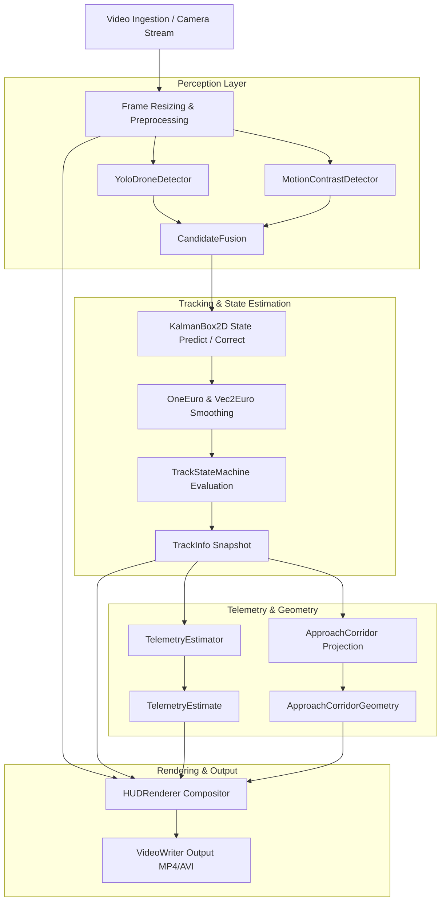

# SkyVanta AI — Volume 1 Architecture Specification
**Autonomous Aerial Perception, Landing Intelligence & Safety Platform**

---

## 1. Executive Summary

Volume 1 (V1) transforms the monolithic software prototype into a modular, production-ready, testable Python package (`skyvanta`) and standardized C++ subsystem (`cpp/`).

Key achievements of Volume 1:
1. **Preservation of Baseline**: The original working prototype is preserved intact in [`legacy/main.py`](file:///c:/Users/Devendraprasad/Downloads/Drone-Landing-Perception-System-main/Drone-Landing-Perception-System-main/legacy/main.py) and [`legacy/main.cpp`](file:///c:/Users/Devendraprasad/Downloads/Drone-Landing-Perception-System-main/Drone-Landing-Perception-System-main/legacy/main.cpp).
2. **Packaging & Clean Dependencies**: Zero runtime package installation (`_ensure()` removed). Declarative packaging defined via [`pyproject.toml`](file:///c:/Users/Devendraprasad/Downloads/Drone-Landing-Perception-System-main/Drone-Landing-Perception-System-main/pyproject.toml) and [`requirements.txt`](file:///c:/Users/Devendraprasad/Downloads/Drone-Landing-Perception-System-main/Drone-Landing-Perception-System-main/requirements.txt).
3. **Strong Typing & Domain Models**: Centralized Pydantic models in [`skyvanta/core/types.py`](file:///c:/Users/Devendraprasad/Downloads/Drone-Landing-Perception-System-main/Drone-Landing-Perception-System-main/skyvanta/core/types.py) (`BoundingBox`, `Detection`, `TrackInfo`, `TelemetryEstimate`, `ApproachCorridorGeometry`, `PerceptionResult`).
4. **Decoupled Perception Subsystem**: Discrete detector implementations for YOLO deep learning inference and MOG2/Farneback motion contrast segmentation.
5. **Robust State Estimation & Tracking**: Linear 2D Kalman filter (`KalmanBox2D`) with dual One Euro adaptive low-pass filters (`Vec2EuroFilter`, `OneEuroFilter`) and 5-state discrete acquisition FSM.
6. **Centralized Configuration**: YAML-serializable configuration models in [`skyvanta/core/config.py`](file:///c:/Users/Devendraprasad/Downloads/Drone-Landing-Perception-System-main/Drone-Landing-Perception-System-main/skyvanta/core/config.py).
7. **Comprehensive Test Suite**: Automated Pytest harness covering unit, integration, and legacy characterization parity tests.

---

## 2. Package Architecture

```
skyvanta/
├── __init__.py               # Package metadata and top-level exports
├── __main__.py               # CLI module runner (python -m skyvanta)
├── cli.py                    # Command-line interface argument parser
├── core/
│   ├── __init__.py
│   ├── types.py              # BoundingBox, Detection, TrackInfo, TelemetryEstimate, etc.
│   ├── config.py             # SkyVantaConfig, DetectorConfig, TrackerConfig, etc.
│   ├── logging.py            # Structured logging subsystem
│   └── exceptions.py         # SkyVantaError, VideoSourceError, ModelLoadError
├── perception/
│   ├── __init__.py
│   ├── detector.py           # YoloDroneDetector (safe import, class filtering)
│   ├── motion.py             # MotionContrastDetector (MOG2 + Farneback + Canny)
│   └── fusion.py             # CandidateFusion (IoU overlap & prioritization)
├── tracking/
│   ├── __init__.py
│   ├── kalman.py             # KalmanBox2D (8-state constant velocity bounding box filter)
│   ├── smoothing.py          # OneEuroFilter, Vec2EuroFilter (jitter reduction)
│   ├── state.py              # TrackStateMachine (SEARCHING -> APPROACHING)
│   └── tracker.py            # DroneTracker (lifecycle, association, trajectory trail)
├── telemetry/
│   ├── __init__.py
│   └── estimator.py          # TelemetryEstimator (visual heuristics)
├── visualization/
│   ├── __init__.py
│   ├── palette.py            # Palette (standardized OpenCV BGR color constants)
│   ├── drawing.py            # draw_dashed_line, draw_glow_circle, rounded_rect, etc.
│   ├── corridor.py           # ApproachCorridor (trapezoidal perspective mesh)
│   └── hud.py                # HUDRenderer (multi-layer tactical compositor)
├── simulation/
│   ├── __init__.py
│   └── synthetic.py          # generate_synthetic_background, SyntheticSceneGenerator
└── pipeline/
    ├── __init__.py
    └── runner.py             # PipelineRunner (video ingestion, batch execution, encoding)
```

---

## 3. Data Flow Diagram



---

## 4. Subsystem Specifications

### 4.1 Core Types (`skyvanta.core.types`)
* `BoundingBox`: Immutable 2D bounding box with `(x1, y1, x2, y2)`, computing `center`, `width`, `height`, `area`, and `iou(other)`.
* `Detection`: Enriched candidate bounding box with `confidence`, `class_name`, and `source` (`yolo` or `motion`).
* `TrackState`: Five-state enumeration (`SEARCHING`, `ACQUIRED`, `TRACKING`, `LOCKED`, `APPROACHING`).
* `TelemetryEstimate`: Explicitly documented heuristic visual estimates (`estimated_distance_m`, `estimated_altitude_m`, `estimated_approach_angle_deg`, `estimated_alignment_pct`, `estimated_lateral_offset_m`, `estimated_vertical_offset_m`, `landing_confidence_pct`).
* `PerceptionResult`: Standardized container encapsulating `metadata`, `track`, `telemetry`, and `corridor` geometry for a single processed frame.

### 4.2 Perception Subsystem (`skyvanta.perception`)
* `YoloDroneDetector`: Loads deep learning model optionally without mutating runtime environment. Filters detections by configured class whitelist (`airplane`, `bird`, `kite`, `frisbee`).
* `MotionContrastDetector`: Extracts moving foreground via MOG2 background subtractor, computes dense optical flow magnitude using Farneback algorithm, applies Canny edge filtering, and scores candidates based on area and edge density.
* `CandidateFusion`: Associative priority engine combining YOLO and motion detections. If detections overlap with $\text{IoU} > 0.10$, boxes are averaged and confidence is boosted to 0.90.

### 4.3 Tracking Subsystem (`skyvanta.tracking`)
* `KalmanBox2D`: 8-state linear Kalman filter tracking bounding box state $\mathbf{x} = [c_x, c_y, w, h, v_x, v_y, v_w, v_h]^T$. Corrects state with measurements $[c_x, c_y, w, h]^T$.
* `OneEuroFilter` & `Vec2EuroFilter`: First-order adaptive low-pass filters with speed-dependent cutoff frequency $\alpha(f_c, f_s)$ for zero-latency jitter removal.
* `DroneTracker`: Full target lifecycle manager maintaining track ID, history trail buffer, scale history for approach trend detection, and jump-distance anomaly gating.

### 4.4 Telemetry Estimation (`skyvanta.telemetry`)
* `TelemetryEstimator`: Derives relative distance from apparent bounding box pixel diagonal against reference diagonal $D_{\text{ref}} = 0.05 \sqrt{W^2 + H^2}$. Derives approach angle and lateral offset from optical center deviation $(c_x - W/2)/(W/2)$.

### 4.5 Visualization Subsystem (`skyvanta.visualization`)
* `Palette`: OpenCV BGR standardized tactical palette.
* `drawing`: Anti-aliased primitives including animated dashed lines, glow markers, rounded transparent panels, scanlines, and viewport corner brackets.
* `ApproachCorridor`: Projects a perspective trapezoidal approach corridor from drone position to ground landing zone.
* `HUDRenderer`: Composites telemetry HUD, top-right lock indicators, bottom-left telemetry table, and approach radar widget.

---

## 5. Verification & Characterization

| Test Suite | Total Tests | Status | Execution Time |
| :--- | :--- | :--- | :--- |
| `tests/unit/test_types.py` | 5 | PASSED | < 0.1s |
| `tests/unit/test_config.py` | 2 | PASSED | < 0.1s |
| `tests/unit/test_kalman.py` | 2 | PASSED | < 0.1s |
| `tests/unit/test_smoothing.py` | 3 | PASSED | < 0.1s |
| `tests/unit/test_tracker.py` | 3 | PASSED | < 0.1s |
| `tests/unit/test_telemetry.py` | 2 | PASSED | < 0.1s |
| `tests/unit/test_perception.py` | 3 | PASSED | < 0.1s |
| `tests/integration/test_pipeline.py` | 1 | PASSED | ~ 0.5s |
| `tests/characterization/test_legacy_parity.py` | 4 | PASSED | < 0.2s |
| **Total** | **25** | **100% PASS** | **1.37s** |
