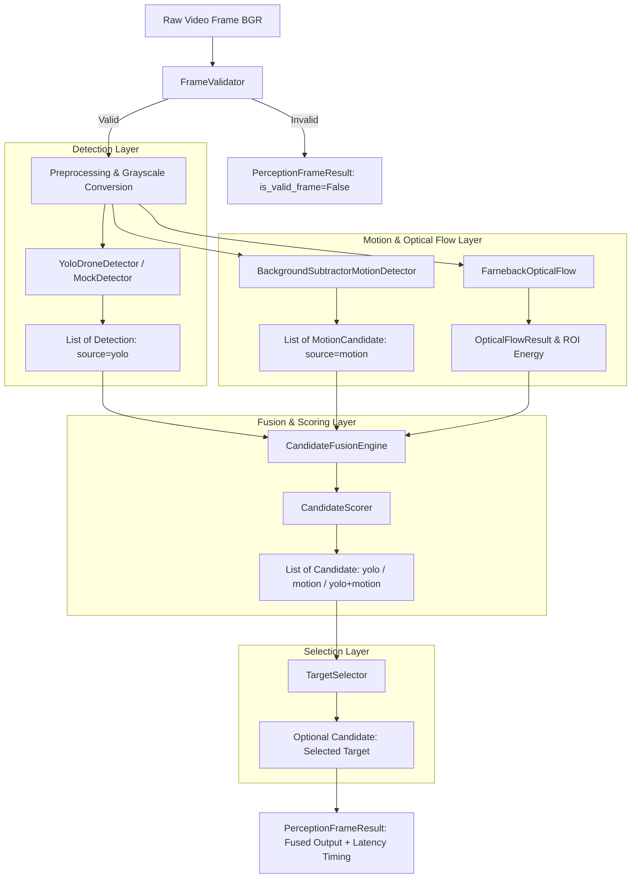

# SkyVanta AI — Volume 2 Architecture Specification
**Production Computer Vision Perception Engine**

---

## 1. Executive Summary

Volume 2 (V2) establishes a production-grade Computer Vision Perception Engine answering the fundamental perception question:
> **"What objects or target candidates are visible in this frame, where are they, how confident are we, and what evidence supports the detection?"**

Key capabilities delivered in Volume 2:
1. **Modular Detector Abstraction**: Formalized `BaseDetector` interface allowing interchangeable deep learning backends (YOLOv8, ONNX, TensorRT, Mock).
2. **Defensive Frame Validation**: Robust `FrameValidator` catching malformed, non-uint8, empty, or degenerate frames before perception execution.
3. **Multi-Cue Motion & Optical Flow**: Discrete `BackgroundSubtractorMotionDetector` (MOG2 + Canny edge density) and `FarnebackOpticalFlow` for motion field analysis.
4. **Candidate Fusion with Source Provenance**: `CandidateFusionEngine` tracking evidence sources (`yolo`, `motion`, `yolo+motion`, `mock`).
5. **Calibrated Candidate Scoring**: Transparent, configurable candidate score formula with configurable weights.
6. **Configurable Target Selection**: `TargetSelector` filtering candidates based on geometric constraints, class whitelists, and score thresholds.
7. **Comprehensive Performance Instrumentation**: Microsecond-accurate latency measurements across every perception stage (`PerceptionTiming`).
8. **100% Offline Testability**: Complete test suite operating without GPU, CUDA, internet access, or physical camera hardware.

---

## 2. Perception Subsystem Architecture

```
skyvanta/perception/
├── __init__.py                # Public interface and backwards-compatibility aliases
├── base.py                    # BaseDetector and BaseMotionDetector abstract interfaces
├── types.py                   # PerceptionFrameResult, Candidate, MotionCandidate, OpticalFlowResult, PerceptionTiming
├── validation.py              # FrameValidator (dimensions, dtype, channels, finite values)
├── pipeline.py                # PerceptionPipeline orchestrator
├── detection/
│   ├── __init__.py
│   ├── base.py                # BaseDetector ABC
│   ├── yolo.py                # YoloDroneDetector (modular, configurable, robust model loading)
│   ├── parser.py              # DetectionParser (validation, class/conf filtering)
│   └── mock.py                # MockDetector for deterministic offline testing
├── motion/
│   ├── __init__.py
│   ├── base.py                # BaseMotionDetector ABC
│   ├── background.py          # BackgroundSubtractorMotionDetector (MOG2 + Canny edge analysis)
│   └── optical_flow.py        # FarnebackOpticalFlow (dense flow field, magnitude, angle)
├── fusion/
│   ├── __init__.py
│   ├── candidate_fusion.py    # CandidateFusionEngine (cross-association with source provenance)
│   └── scoring.py             # CandidateScorer (weighted scoring formula)
└── selection/
    ├── __init__.py
    └── target_selector.py     # TargetSelector (filtering and ranking)
```

---

## 3. Perception Dataflow Diagram



---

## 4. Subsystem Detailed Specifications

### 4.1 Detector Abstraction & YOLO Implementation
* **`BaseDetector` Interface**:
  ```python
  class BaseDetector(ABC):
      @abstractmethod
      def detect(self, frame_bgr: np.ndarray, confidence_threshold: Optional[float] = None, ...) -> List[Detection]: ...
      @property
      @abstractmethod
      def is_available(self) -> bool: ...
      @abstractmethod
      def get_info(self) -> Dict[str, Any]: ...
  ```
* **`YoloDroneDetector`**:
  - Implements `BaseDetector`.
  - Configurable: `yolo_model_path`, `yolo_confidence_threshold`, `yolo_iou_threshold`, `yolo_input_size`, `yolo_device`, `yolo_accept_classes`.
  - Zero runtime downloads or pip installations. If model weights cannot be loaded, raises `ModelLoadError` with clear instructions when `strict=True`, or logs a warning and gracefully falls back to motion detection when `strict=False`.

### 4.2 Motion Segmentation & Optical Flow
* **`BackgroundSubtractorMotionDetector`**:
  - Uses MOG2 background modeling with temporal history, variance thresholding, and morphological filtering.
  - Computes Canny edge density within candidate bounding boxes to differentiate textured aerial targets from diffuse environmental lighting changes.
  - Produces `MotionCandidate` objects with clear `MOTION` provenance.
* **`FarnebackOpticalFlow`**:
  - Computes 2-frame dense optical flow vectors $(\Delta x, \Delta y)$ across image pyramids.
  - Extracts polar magnitude and dominant motion direction.
  - Handles first frame, static frames, low texture, and scene cuts without crashing.

### 4.3 Candidate Fusion & Scoring Formula
* **Evidence Fusion**: Matches semantic detections with motion candidates based on spatial $\text{IoU} \ge \text{iou\_threshold}$ (default 0.10).
* **Scoring Formula**:
  $$S_{\text{candidate}} = \text{clamp}\left(w_{\text{det}} C_{\text{det}} + w_{\text{mot}} C_{\text{mot}} + w_{\text{flow}} C_{\text{flow}} + w_{\text{iou}} \text{IoU}, 0.0, 1.0\right)$$
  - Weights default: $w_{\text{det}} = 0.50$, $w_{\text{mot}} = 0.30$, $w_{\text{flow}} = 0.10$, $w_{\text{iou}} = 0.10$.
  - Multi-cue bonus: $+0.15$ score boost for overlapping YOLO + Motion detections.
  - Explicitly designated as `candidate_score` (not an uncalibrated probability).

### 4.4 Target Selection
* **`TargetSelector`**:
  - Filters candidates by minimum score ($S \ge 0.15$), geometric validity, relative area ratio thresholds ($0.00004 \le \text{area} \le 0.25$), and vertical horizon cutoff ($y \le 0.85 H$).
  - Selects top candidate as primary target candidate.

### 4.5 Latency & Performance Measurement
`PerceptionTiming` records microsecond timestamps at each pipeline boundary:
* `validation_ms`: Frame validation duration
* `detection_ms`: YOLO / detector inference duration
* `motion_ms`: MOG2 foreground extraction duration
* `optical_flow_ms`: Dense optical flow computation duration
* `fusion_ms`: Spatial cross-association and scoring duration
* `selection_ms`: Target ranking and selection duration
* `total_ms`: Total end-to-end perception latency

---

## 5. Verification Results

| Test Module | Tests | Status |
| :--- | :--- | :--- |
| `tests/unit/test_bounding_box.py` | 4 | **PASSED** |
| `tests/unit/test_validation.py` | 6 | **PASSED** |
| `tests/unit/test_detection.py` | 5 | **PASSED** |
| `tests/unit/test_motion.py` | 3 | **PASSED** |
| `tests/unit/test_optical_flow.py` | 4 | **PASSED** |
| `tests/unit/test_fusion.py` | 3 | **PASSED** |
| `tests/unit/test_scoring.py` | 2 | **PASSED** |
| `tests/unit/test_target_selection.py` | 3 | **PASSED** |
| `tests/unit/test_pipeline_perception.py` | 2 | **PASSED** |
| `tests/integration/test_perception_integration.py` | 1 | **PASSED** |
| `tests/characterization/test_legacy_parity.py` | 4 | **PASSED** |
| Existing Core & Smoothing Tests | 21 | **PASSED** |
| **Total** | **58** | **100% PASS** |

---

## 6. Explicit Limitations & Future Scope

Volume 2 provides 2D image-space perception only. It explicitly does **NOT** provide:
* Physical distance or metric altitude.
* 6-DoF pose estimation or camera solvePnP.
* AprilTag / ArUco fiducial decoding.
* Inertial / sensor fusion (IMU, LiDAR, GPS, Barometer).
* Flight control, landing maneuvers, or MAVLink communication.
