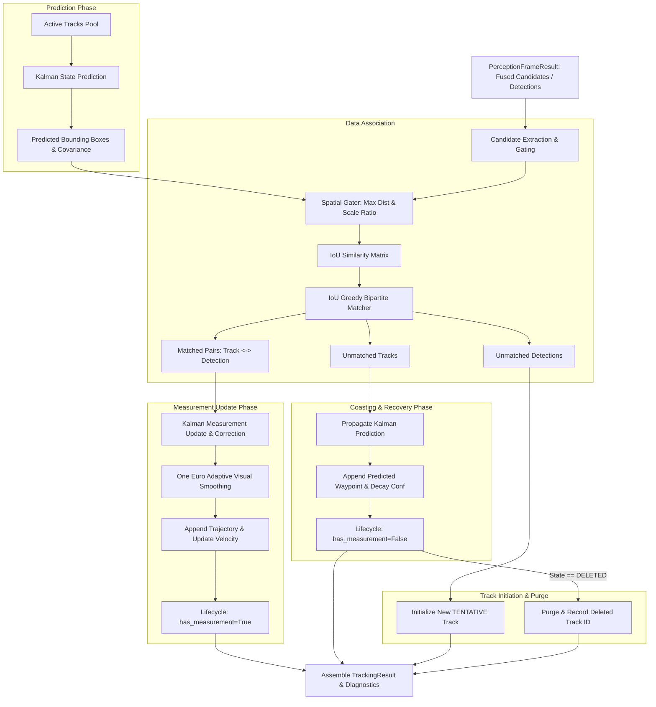

# SkyVanta AI — Volume 3 Architecture Specification
**Multi-Target Tracking & State Estimation Engine**

---

## 1. Executive Summary

Volume 3 (V3) establishes a production-grade, deterministic Multi-Target Tracking and 2D State Estimation subsystem. It consumes upstream candidates and detections produced by Volume 2 perception to answer:
> **"Which detections belong to which existing objects, where are those objects moving in image space, how reliable is each track, and what happens when a target is temporarily occluded?"**

### Core Capabilities Delivered in Volume 3:
1. **Multi-Target State Management (`MultiTargetTrackManager`)**: Maintains independent state, filter matrices, lifecycle state machines, and historical trails for multiple concurrent objects.
2. **Stable Deterministic Track Identity**: Assigns unique, monotonic track IDs that persist across continuous detections and through temporary occlusion grace periods.
3. **Data Association with Spatial Gating (`IoUAssociator`, `SpatialGater`)**: Matches incoming perception candidates to predicted track states using spatial IoU cost matrices, bounded by Euclidean center distance and scale consistency constraints.
4. **8-State Linear Kalman Prediction & Kinematics (`KalmanBox2D`)**: Models 2D position $(c_x, c_y)$, bounding box dimensions $(w, h)$, and velocities $(\dot{c}_x, \dot{c}_y, \dot{w}, \dot{h})$ in image pixel space.
5. **Decoupled Adaptive Smoothing (`OneEuroFilter`, `Vec2EuroFilter`)**: Eliminates high-frequency pixel jitter without altering the underlying Kalman kinematic state.
6. **Deterministic 6-State Track Lifecycle (`TrackLifecycleStateMachine`)**: Formalized progression: `TENTATIVE` $\to$ `CONFIRMED` $\to$ `TRACKING` $\to$ `COASTING` $\to$ `LOST` $\to$ `DELETED`.
7. **Bounded Trajectory Memory & Image Velocity (`TrajectoryHistory`)**: Maintains a memory-safe, fixed-window deque of waypoints, calculating EMA-smoothed image velocity (`px/sec`) and scale expansion rates.
8. **Calibrated Composite Track Quality (`TrackQualityConfig`)**: Evaluates track reliability using weighted hit ratio, smoothed confidence, and consecutive hit continuity.
9. **Subsystem Instrumentation (`TrackingTiming`, `TrackingMetrics`)**: Microsecond-accurate latency measurements for prediction, association, update, smoothing, and lifecycle management.

---

## 2. Tracking Subsystem Architecture

```
skyvanta/tracking/
├── __init__.py                # Public interface and backwards-compatibility aliases
├── types.py                   # Track, TrajectoryPoint, TrackingResult, TrackingMetrics, TrackingTiming
├── manager.py                 # MultiTargetTrackManager (Orchestrator)
├── association/
│   ├── __init__.py
│   ├── base.py                # BaseAssociator abstract base class
│   ├── gating.py              # SpatialGater (center distance & scale consistency)
│   └── iou.py                 # IoUAssociator (greedy bipartite matching with gating)
├── filters/
│   ├── __init__.py
│   ├── kalman.py              # KalmanBox2D (8-state 2D constant velocity filter)
│   └── smoothing.py           # OneEuroFilter & Vec2EuroFilter adaptive low-pass filters
├── lifecycle/
│   ├── __init__.py
│   └── state_machine.py       # TrackLifecycleStateMachine (6-state deterministic FSM)
├── trajectory/
│   ├── __init__.py
│   └── history.py             # TrajectoryHistory (bounded deque, velocity, scale trend)
└── metrics/
    ├── __init__.py
    └── tracking_metrics.py    # TrackingMetricsCollector (runtime tracking health analytics)
```

---

## 3. End-to-End Tracking Dataflow Diagram



---

## 4. Subsystem Detailed Specifications

### 4.1 Track Data Model (`Track`)
Every track is represented by a strongly typed Pydantic v2 model:
* **`track_id`**: Unique monotonic integer ID.
* **`state`**: Current lifecycle state (`TENTATIVE`, `CONFIRMED`, `TRACKING`, `COASTING`, `LOST`, `DELETED`).
* **`bbox`**: Current filtered and smoothed bounding box.
* **`predicted_bbox`**: Prior Kalman prediction bounding box.
* **`confidence`**: Smoothed detection confidence score $[0.0, 1.0]$.
* **`track_quality`**: Composite track reliability rating $[0.0, 1.0]$.
* **`age`**: Total elapsed frames since track creation.
* **`hits`**: Total frames successfully matched with a measurement.
* **`consecutive_hits`**: Current uninterrupted run of matched frames.
* **`missed_frames`**: Number of consecutive frames without measurement.
* **`velocity_px_per_sec`**: Estimated 2D image-space velocity $(\dot{x}, \dot{y})$ in pixels/second.
* **`source_class`**: Detector semantic class label (e.g. `drone`, `landing_pad`).
* **`source`**: Detection provenance (`yolo`, `motion`, `yolo+motion`, `mock`).
* **`trajectory`**: Ordered list of historical `TrajectoryPoint` objects.
* **`created_at_sec`** / **`last_seen_sec`**: Microsecond timestamps.

### 4.2 Data Association & Gating
* **`SpatialGater`**: Rejects pairings before IoU computation if:
  1. Center pixel distance $> \text{max\_center\_distance\_px}$ (default: $180\text{px}$).
  2. Bounding box area ratio $\frac{\text{area}_{det}}{\text{area}_{track}} \notin [\text{min\_scale\_ratio}, \text{max\_scale\_ratio}]$ (default: $[0.2, 5.0]$).
* **`IoUAssociator`**:
  - Computes IoU similarity matrix over gated pairs.
  - Performs greedy bipartite matching from highest IoU down to $\text{min\_iou}$ (default: $0.15$).
  - Separates matched pairs from unmatched tracks and unmatched detections.

### 4.3 Kalman 2D State Estimation (`KalmanBox2D`)
Linear 8-state constant velocity model in image coordinates:
$$\mathbf{x} = \begin{bmatrix} c_x & c_y & w & h & v_x & v_y & v_w & v_h \end{bmatrix}^T$$
$$\mathbf{z} = \begin{bmatrix} c_x & c_y & w & h \end{bmatrix}^T$$
* **Transition Matrix ($\mathbf{F}$)**:
  $$\mathbf{F} = \begin{bmatrix} \mathbf{I}_{4\times 4} & \Delta t \mathbf{I}_{4\times 4} \\ \mathbf{0}_{4\times 4} & \mathbf{I}_{4\times 4} \end{bmatrix}$$
* **Process Noise Covariance ($\mathbf{Q}$)**: $\mathbf{Q} = \sigma_p^2 \mathbf{I}_8$ (default: $10^{-2}$).
* **Measurement Noise Covariance ($\mathbf{R}$)**: $\mathbf{R} = \sigma_m^2 \mathbf{I}_4$ (default: $10^{-1}$).

### 4.4 Adaptive Smoothing (`OneEuroFilter`)
Applied after Kalman update to filter visual bounding box jitter without corrupting filter covariance or physical state estimation:
$$\alpha = \frac{1}{1 + \tau / T_e}, \quad \tau = \frac{1}{2\pi f_c}, \quad f_c = f_{c,\text{min}} + \beta |\dot{x}|$$
* Low velocities $\to$ low cutoff frequency (aggressive jitter suppression).
* High velocities $\to$ high cutoff frequency (zero latency lag during rapid maneuvers).

### 4.5 Track Lifecycle State Machine
```
[ New Detection ]
       |
       v
+--------------+   Hit >= min_confirmed_hits (3)   +---------------+
|  TENTATIVE   | --------------------------------> |   CONFIRMED   |
+-------+------+                                   +-------+-------+
        |                                                  |
        | Miss >= max_tentative_misses (2)                 | Consecutive Hit
        v                                                  v
+--------------+                                   +---------------+
|   DELETED    | <-------------------------------- |   TRACKING    |
+--------------+                                   +-------+-------+
        ^                                                  |
        | Miss >= max_lost_frames (45)                     | Miss >= 1
        |                                                  v
+--------------+    Miss >= max_coasting_frames    +---------------+
|     LOST     | <-------------------------------- |   COASTING    |
+-------+------+                (15)               +-------+-------+
        |                                                  |
        +---------------- Hit Reacquired ------------------+
```

### 4.6 Bounded Trajectory History (`TrajectoryHistory`)
* Fixed maximum history length (default: 60 frames) prevents unbounded memory growth.
* Calculates exponential moving average (EMA) velocity in pixels per second:
  $$\mathbf{v}_t = \alpha \frac{\mathbf{p}_t - \mathbf{p}_{t-1}}{\Delta t} + (1 - \alpha) \mathbf{v}_{t-1}$$
* Computes normalized area expansion rate for visual approach detection.

### 4.7 Track Quality Rating
Calculated per frame as a bounded $[0.0, 1.0]$ composite metric:
$$\text{Quality} = w_h \cdot \frac{\text{Hits}}{\text{Age}} + w_c \cdot \text{Confidence} + w_{\text{cont}} \cdot \min\left(1.0, \frac{\text{Consecutive Hits}}{5}\right)$$
Default weights: $w_h = 0.40, w_c = 0.40, w_{\text{cont}} = 0.20$.

---

## 5. Configuration Schema

Configured via `config/default.yaml` and `TrackingConfig`:
```yaml
tracking:
  enabled: true
  kalman_process_noise: 0.01
  kalman_measurement_noise: 0.10
  association:
    min_iou: 0.15
    max_center_distance_px: 180.0
    min_scale_ratio: 0.2
    max_scale_ratio: 5.0
  lifecycle:
    min_confirmed_hits: 3
    max_tentative_misses: 2
    max_coasting_frames: 15
    max_lost_frames: 45
  trajectory:
    max_history_length: 60
    velocity_smoothing_alpha: 0.3
  quality:
    weight_hit_ratio: 0.40
    weight_confidence: 0.40
    weight_continuity: 0.20
```

---

## 6. Verification and Test Strategy

* **82 Automated Unit & Integration Tests**:
  - `test_track_model.py`: Model creation, validation, JSON serialization/deserialization.
  - `test_association.py`: Perfect overlap, partial overlap, zero overlap, spatial gating, multi-candidate competition.
  - `test_kalman.py`: State initialization, prediction, measurement update, constant-velocity estimation, noise filtering.
  - `test_lifecycle.py`: Deterministic state transitions, coasting, lost, recovery, tentative misses, deletion purge.
  - `test_trajectory.py`: Bounded memory deque, velocity estimation, scale expansion rate, clearing.
  - `test_track_manager.py`: Multi-target stable IDs, track quality scoring, retrieval, reset.
  - `test_tracking_integration.py`: End-to-end full lifecycle, 3-target simultaneous tracking, crossing trajectories.
* **100% Offline Testability**: Operates without GPU, CUDA, physical camera, or internet access.

---

## 7. Known Subsystem Boundaries & Limitations

### Volume 3 Provides:
- 2D image-space multi-target tracking.
- Image velocity in pixels/second (`image_velocity_px_per_sec`).
- Temporal track identity preservation through occlusion.
- Bounded 2D trajectory trails.
- Track quality scoring.

### Volume 3 Strictly Excludes (Handled in V4+):
- Metric 3D position $(x, y, z)$ in meters (Volume 4 & 5).
- Fiducial marker detection (AprilTag / ArUco) (Volume 4).
- PnP pose geometry & camera intrinsics (Volume 4).
- Metric velocity ($m/s$), altitude ($m$), and world frame coordinates (Volume 5 & 6).
- IMU, LiDAR, Barometer, and GPS sensor fusion (Volume 6).
- Flight control, FSM landing intelligence, and safety overrides (Volume 7 & 8).
