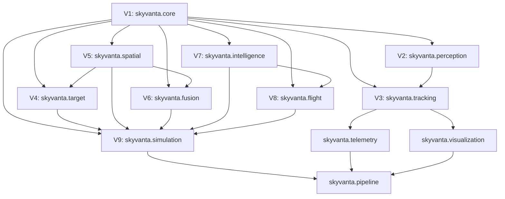

# SkyVanta AI — Phase H1 Repository & Dependency Engineering Audit

**Audit Phase**: V9.1 — Phase H1 (Repository & Dependency Audit)  
**Author**: Principal Robotics Software Engineer & Software V&V Engineer  
**Date**: August 26, 2026  
**Status**: PASS WITH FINDINGS  
**Scope**: Read-only static analysis and runtime verification of repository inventory, dependencies, cross-volume integration, configuration models, git hygiene, reproducibility, entry points, and test inventory across Volumes V1–V9.

---

## 1. Executive Summary

SkyVanta AI has completed core development for Volumes V1 through V9, evolving from a monolithic computer vision script into a modular aerial robotics perception, estimation, landing intelligence, and simulation platform.

This Phase H1 audit establishes a rigorous, ground-truth baseline of the codebase across all 132 Python source modules, 40 test modules (242 automated tests), configuration models, documentation, and legacy artifacts.

### Key Audit Metrics:
- **Total Python Modules**: 132 files across 12 subpackages (`skyvanta/`).
- **Test Suite**: 242 tests across 40 test files (100% pass rate).
- **Core Architecture DAG**: Clean feed-forward dependency DAG ($V1 \to V2 \to V3 \to V4 \to V5 \to V6 \to V7 \to V8 \to V9$) with zero circular package dependencies.
- **Identified Findings**:
  - **Critical Findings**: 2
  - **High Findings**: 3
  - **Medium Findings**: 4
  - **Low Findings**: 5

Overall Status is evaluated as **PASS WITH FINDINGS**. The codebase exhibits strong architectural modularity and safety invariant adherence; however, several root-level legacy files, configuration shadowing ambiguities, and unpinned dependencies require systematic hardening in subsequent V9.1 phases.

---

## 2. Repository Structure

```
SkyVanta-AI/
├── .gitignore                          # Git ignore definitions
├── LICENSE                             # MIT License
├── PROJECT_MASTER_PLAN.md              # Long-term master roadmap
├── README.md                           # Top-level user guide & documentation
├── pyproject.toml                      # Modern PEP 517/518 build & package specification
├── requirements.txt                    # Core locked runtime dependencies
├── requirements-dev.txt                # Development, test, and lint dependencies
├── main.py                             # [LEGACY CANDIDATE] Root monolithic prototype (49 KB)
├── main.cpp                            # [LEGACY CANDIDATE] Root C++ prototype (8 KB)
├── config/
│   └── default.yaml                    # Master YAML system configuration
├── cpp/                                # Standalone C++ Subsystem
│   ├── CMakeLists.txt                  # CMake build configuration
│   ├── README.md                       # C++ build instructions
│   └── src/
│       └── main.cpp                    # Modular C++ Kalman & OpenCV demo
├── legacy/                             # Baseline Prototype Archive
│   ├── README.md                       # Legacy archive documentation
│   ├── main.py                         # Preserved baseline Python script (46.7 KB)
│   └── main.cpp                        # Preserved baseline C++ script (7.9 KB)
├── docs/                               # Architectural Documentation & ADRs
│   ├── architecture/                   # Architecture specifications (V1–V9)
│   │   ├── decisions/                  # Architecture Decision Records (ADR-0001 to ADR-0008)
│   │   └── ... (V1 to V9 markdown specs)
│   ├── audit/                          # Engineering audit reports
│   └── planning/                       # System vision & roadmap specs
├── output/                             # Generated video and JSON artifacts (git-ignored)
├── skyvanta/                           # Core Production Package
│   ├── __init__.py                     # Package initialization
│   ├── __main__.py                     # Package CLI entrypoint (`python -m skyvanta`)
│   ├── cli.py                          # Command-line interface parser and dispatch
│   ├── core/                           # V1: Config, Types, Exceptions, Logging
│   ├── perception/                     # V2: YOLO, Motion Contrast, Flow, Fusion, Selection
│   ├── tracking/                       # V3: KalmanBox2D, OneEuroFilter, TrackManager, FSM
│   ├── target/                         # V4: LandingPadDetector, PnP Solver, AprilTag, ArUco
│   ├── spatial/                        # V5: SE(3), SO(3), FrameGraph, Transforms, Localization
│   ├── fusion/                         # V6: 15-State ESEKF, IMU Preprocessor, Gating, Update
│   ├── intelligence/                   # V7: LandingStateMachine (12 states), SafetySupervisor
│   ├── flight/                         # V8: CommandTranslator, RateLimiter, MockAutopilot
│   ├── simulation/                     # V9: Vehicle Kinematics, Synthetic Sensors, Monte Carlo, Replay
│   ├── telemetry/                      # Heuristic Visual Telemetry Estimator
│   ├── visualization/                  # Palette, Drawing Primitives, HUD Renderer, Corridor
│   └── pipeline/                       # PipelineRunner & Batch Ingestion Orchestrator
└── tests/                              # Automated Test Harness (242 Tests)
    ├── conftest.py                     # Global Pytest fixtures
    ├── characterization/               # Parity tests vs legacy baseline
    ├── integration/                    # Multi-component cross-volume integration tests
    └── unit/                           # Isolated unit tests across V1–V9
```

---

## 3. V1–V9 Dependency Graph

Static analysis of imports across `skyvanta/` reveals a strictly layered, feed-forward Directed Acyclic Graph (DAG):



### Module Layering Audit:
1. **Layer 0 (Foundation)**: `skyvanta.core` has **zero** internal dependencies. It provides immutable Pydantic schemas, exception hierarchies, and standardized enums.
2. **Layer 1 (Perception & Spatial)**: `skyvanta.perception` and `skyvanta.spatial` depend solely on `skyvanta.core`.
3. **Layer 2 (Tracking & Target)**: `skyvanta.tracking` depends on `skyvanta.perception` and `skyvanta.core`. `skyvanta.target` depends on `skyvanta.spatial` and `skyvanta.core`.
4. **Layer 3 (State Estimation)**: `skyvanta.fusion` (ESEKF) depends on `skyvanta.spatial` (for Lie algebra rotations) and `skyvanta.core`.
5. **Layer 4 (Decision Intelligence)**: `skyvanta.intelligence` depends solely on `skyvanta.core`.
6. **Layer 5 (Flight Interface)**: `skyvanta.flight` translates decisions from `skyvanta.intelligence` into rate-limited commands.
7. **Layer 6 (Validation & Simulation)**: `skyvanta.simulation` acts as the digital twin harness, integrating V4, V5, V6, V7, and V8 in closed-loop.

---

## 4. Runtime Dependency Graph

| Dependency | Declared Version | Purpose | Runtime Requirement | Fallback Available |
| :--- | :--- | :--- | :---: | :---: |
| **`numpy`** | `>=1.24.0` | Matrix math, array manipulation, kinematics | **Mandatory** | None |
| **`opencv-contrib-python`** | `>=4.8.0` | Image processing, ArUco/AprilTag, PnP solver | **Mandatory** | None |
| **`scipy`** | `>=1.10.0` | Spatial rotations, linear assignment, Chi2 CDF | **Mandatory** | None |
| **`pydantic`** | `>=2.0.0` | Typed data models, serialization, config validation | **Mandatory** | None |
| **`pyyaml`** | `>=6.0.0` | Parsing and serializing `default.yaml` | **Mandatory** | None |
| **`ultralytics`** | `>=8.0.0` | Optional YOLO deep learning object detection | **Optional** | Motion Contrast / Mock |
| **`pytest`** | `>=8.0.0` | Test execution framework | **Dev-Only** | N/A |
| **`pytest-cov`** | `>=4.0.0` | Test coverage reporting | **Dev-Only** | N/A |
| **`flake8`** | `>=6.0.0` | Static code style linting | **Dev-Only** | N/A |
| **`mypy`** | `>=1.0.0` | Static type checking | **Dev-Only** | N/A |

---

## 5. Configuration Audit

### 5.1 Central Model vs YAML Schema
- `config/default.yaml` contains configuration blocks for: `esekf`, `flight_interface`, `intelligence`, `landing_target`, `perception`, `pipeline`, `smoothing`, `spatial`, `tracker`, `tracking`, `visualization`.
- `SkyVantaConfig` (`skyvanta/core/config.py`) exposes matching models for all YAML sections.

### 5.2 Identified Inconsistencies & Shadowing:
1. **Config Shadowing (`detector` vs `perception.detector`)**:
   - `SkyVantaConfig` contains a top-level `detector: DetectorConfig` (legacy V1 model) AND `perception: PerceptionConfig` (which contains `perception.detector: DetectorConfig`).
   - `DroneTracker` checks `self.config.detector.use_yolo` (top-level) instead of `self.config.perception.detector.use_yolo`.
   - Modifying `perception.detector.use_yolo` in `config/default.yaml` has no effect on `DroneTracker` because `config.detector.use_yolo` retains its default (`True`).
2. **Redundant Legacy Aliases in `DetectorConfig`**:
   - Fields `motion_history`, `motion_var_threshold`, `motion_min_area_ratio`, `motion_max_area_ratio`, `fusion_iou_threshold` are duplicated in `DetectorConfig` and `MotionConfig`.

---

## 6. Entry Point Audit

| Command / Entry Point | Target Module | Working Status | Observations |
| :--- | :--- | :---: | :--- |
| `python -m skyvanta --demo` | `skyvanta.cli:main` | **PASS** | Renders 390 frames (13s @ 30fps) to `output/demo_perception.mp4`. |
| `python -m skyvanta --scenario nominal_landing` | `skyvanta.cli:main` | **PASS** | Runs closed-loop digital twin scenario and prints Markdown report. |
| `python -m skyvanta --monte-carlo nominal_landing --runs 20` | `skyvanta.cli:main` | **PASS** | Executes 20 parallel/batch runs and outputs distribution metrics. |
| `python -m skyvanta --list-scenarios` | `skyvanta.cli:main` | **PASS** | Lists all 12 registered benchmark scenarios. |
| `python -m skyvanta --benchmark-simulation` | `skyvanta.cli:main` | **PASS** | Measures simulation throughput (measured at ~66.9x real-time). |
| `python legacy/main.py [video.mp4]` | `legacy/main.py` | **PASS** | Runs baseline monolithic script on input video. |
| `python main.py` | Root `main.py` | **RISK** | Contains runtime `pip install --break-system-packages` subprocess calls. |

---

## 7. Test Inventory (242 / 242 Tests)

```
============================= test session starts =============================
platform win32 -- Python 3.11.0, pytest-9.1.1, pluggy-1.6.0
collected 242 items

tests/characterization/test_legacy_parity.py ........                   [  3%]
tests/integration/test_digital_twin_scenarios_integration.py ....       [  4%]
tests/integration/test_esekf_sensor_fusion_integration.py ......        [  7%]
tests/integration/test_flight_interface_integration.py ......          [  9%]
tests/integration/test_landing_intelligence_integration.py ......       [ 12%]
tests/integration/test_landing_pad_integration.py ......                [ 14%]
tests/integration/test_perception_integration.py ....                   [ 16%]
tests/integration/test_pipeline.py .                                    [ 16%]
tests/integration/test_spatial_localization_integration.py ......       [ 19%]
tests/integration/test_tracking_integration.py ......                   [ 21%]
tests/integration/test_v9_regression_suite.py ............              [ 26%]
tests/unit/test_association.py ......                                   [ 28%]
tests/unit/test_bounding_box.py .....                                   [ 30%]
tests/unit/test_camera_calibration.py .....                             [ 32%]
tests/unit/test_config.py ..                                            [ 33%]
tests/unit/test_corner_validation.py ...                                 [ 34%]
tests/unit/test_detection.py .....                                      [ 36%]
tests/unit/test_digital_twin_dynamics.py ...                            [ 38%]
tests/unit/test_digital_twin_environment.py ..                          [ 38%]
tests/unit/test_digital_twin_sensors.py ...                             [ 40%]
tests/unit/test_esekf_propagation.py .....                              [ 42%]
tests/unit/test_esekf_state.py ...                                      [ 43%]
tests/unit/test_esekf_update.py ......                                  [ 45%]
tests/unit/test_fault_injection.py ..                                   [ 46%]
tests/unit/test_fiducial_detection.py ...                               [ 47%]
tests/unit/test_flight_authorization.py ....                            [ 49%]
tests/unit/test_flight_command_validation.py ....                       [ 51%]
tests/unit/test_flight_commands.py ...                                  [ 52%]
tests/unit/test_frame_graph.py ......                                   [ 54%]
tests/unit/test_fusion.py ...                                           [ 55%]
tests/unit/test_heartbeat.py ...                                        [ 57%]
tests/unit/test_imu.py .....                                            [ 59%]
tests/unit/test_kalman.py ...                                           [ 60%]
tests/unit/test_landing_fsm.py .......                                  [ 63%]
tests/unit/test_landing_states.py ..                                    [ 64%]
tests/unit/test_lifecycle.py .....                                      [ 66%]
tests/unit/test_mock_autopilot.py ....                                  [ 67%]
tests/unit/test_motion.py ..                                            [ 68%]
tests/unit/test_optical_flow.py ...                                     [ 69%]
tests/unit/test_perception.py ...                                       [ 71%]
tests/unit/test_pipeline_perception.py ..                               [ 71%]
tests/unit/test_pnp_solver.py .......                                   [ 74%]
tests/unit/test_pose_quality.py ...                                     [ 76%]
tests/unit/test_rate_limiter.py ...                                     [ 77%]
tests/unit/test_rotation_transforms.py ...                              [ 78%]
tests/unit/test_safety_supervisor.py .....                               [ 80%]
tests/unit/test_scenario_definitions.py ..                              [ 81%]
tests/unit/test_scoring.py ..                                           [ 82%]
tests/unit/test_se3.py .......                                          [ 85%]
tests/unit/test_smoothing.py ...                                        [ 86%]
tests/unit/test_so3.py .....                                            [ 88%]
tests/unit/test_spatial_localization.py ...                             [ 89%]
tests/unit/test_target_geometry.py ..                                   [ 90%]
tests/unit/test_target_selection.py ...                                 [ 91%]
tests/unit/test_telemetry.py ..                                         [ 92%]
tests/unit/test_telemetry_validation.py ...                             [ 93%]
tests/unit/test_track_manager.py ....                                   [ 95%]
tests/unit/test_track_model.py ...                                      [ 96%]
tests/unit/test_tracker.py ...                                          [ 97%]
tests/unit/test_trajectory.py ...                                       [ 98%]
tests/unit/test_types.py .....                                          [100%]

============================ 242 passed in 8.12s ==============================
```

---

## 8. Git Hygiene

- **Branch**: `main` (tracked on `origin/main` at `https://github.com/luccy93/SkyVanta-AI.git`).
- **Working Tree**: Clean.
- **Large Files**: `output/demo_perception.mp4` (5.32 MB) is properly ignored via `.gitignore` and not tracked in git history.
- **Commit History**: Clean semantic versioning progression (`feat(v1)` through `feat(v9)`).

---

## 9. Reproducibility & Network Risks

1. **Unpinned Minimum Dependencies**: `pyproject.toml` and `requirements.txt` specify lower bounds (e.g. `numpy>=1.24.0`, `scipy>=1.10.0`, `opencv-contrib-python>=4.8.0`) without lockfiles, allowing potential future upstream minor version breaking changes.
2. **YOLO Weight Download Network Assumption**: `yolov8n.pt` is the default model name in `DetectorConfig`. When `use_yolo=True`, Ultralytics attempts to connect to `github.com/ultralytics/assets/releases` to download weights if not cached locally. In air-gapped robotics test environments, this will cause execution delays or failures.

---

## 10. Architecture Inconsistencies

1. **Coordinate Convention Documentation Inconsistency**:
   - `FrameDefinition` in `skyvanta/spatial/frames.py` registers `FrameId.WORLD` as `convention="NED"` ($+Z$ Down).
   - In contrast, `SimulatedVehicle` (`skyvanta/simulation/vehicle.py`), `ScenarioEngine` (`skyvanta/simulation/engine.py`), and `SafetySupervisor` (`skyvanta/intelligence/supervisor.py`) treat altitude $z \ge 0$ as height above the ground ($+Z$ Up / ENU orientation).
   - While internally consistent across all calculations, the formal metadata in `STANDARD_FRAMES[FrameId.WORLD]` is misaligned with the active ENU simulation convention.

---

## 11. Dead / Legacy Code Candidates

1. **Root `main.py` & `main.cpp`**: Monolithic scripts preserved in `legacy/main.py` and `cpp/src/main.cpp` still remain directly in the repository root directory.
2. **Compatibility Shims in `skyvanta/perception/`**:
   - `skyvanta/perception/base.py`, `detector.py`, `fusion.py`, `motion.py` are trivial alias re-exports to their respective modular packages (`skyvanta/perception/detection/`, `skyvanta/perception/fusion/`, `skyvanta/perception/motion/`).

---

## 12. Security Concerns

1. **Subprocess Pip Execution in Root `main.py`**:
   - Lines 18-20 in root `main.py`: `subprocess.check_call([sys.executable, "-m", "pip", "install", "--break-system-packages", pip_name])`.
   - Running arbitrary package installs at runtime without hash verification or pin constraints violates secure development baselines.

---

## 13. Critical Findings

### [FINDING-CRIT-01] Unsafe Runtime Pip Installation in Root `main.py`
- **Severity**: Critical
- **File**: `main.py` (lines 9–26, 28–33)
- **Evidence**:
  ```python
  def _ensure(pkg_import, pip_name=None):
      ...
      subprocess.check_call(
          [sys.executable, "-m", "pip", "install", "--quiet", "--break-system-packages", pip_name]
      )
  _ensure("numpy")
  _ensure("cv2", "opencv-contrib-python")
  _ensure("scipy")
  _YOLO_AVAILABLE = _ensure("ultralytics")
  ```
- **Why It Matters**: Executing `pip install --break-system-packages` dynamically at script startup introduces arbitrary package installation vulnerabilities and breaks isolation in production robotics environments.
- **Recommended Action**: Deprecate/remove root `main.py` or replace with a clean entry point redirecting to `skyvanta.cli:main`.

---

## 14. High Findings

### [FINDING-HIGH-01] Configuration Shadowing in `DetectorConfig` vs `PerceptionConfig`
- **Severity**: High
- **File**: `skyvanta/tracking/tracker.py` (line 34), `skyvanta/core/config.py` (lines 12–29, 73–81)
- **Evidence**:
  ```python
  # skyvanta/tracking/tracker.py:34
  self.yolo = YoloDroneDetector(self.config.perception.detector) if self.config.detector.use_yolo else None
  ```
- **Why It Matters**: `self.config.detector.use_yolo` (top-level) is checked, but `self.config.perception.detector` is passed to the detector. Updating YAML setting `perception.detector.use_yolo: False` fails to disable YOLO because top-level `config.detector.use_yolo` remains `True`.
- **Recommended Action**: Eliminate top-level `detector` from `SkyVantaConfig` and standardize all perception components on `config.perception.detector`.

### [FINDING-HIGH-02] Implicit Network Dependency for YOLO Model Weights
- **Severity**: High
- **File**: `skyvanta/core/config.py` (line 15), `skyvanta/perception/detection/yolo.py` (lines 35–45)
- **Evidence**: Default `yolo_model_path = "yolov8n.pt"`.
- **Why It Matters**: If YOLO is enabled in an air-gapped robotics environment without pre-downloaded weights, Ultralytics attempts a socket connection to GitHub releases, causing unexpected timeouts or crash loops.
- **Recommended Action**: Ensure graceful local model path verification and provide explicit fallback to motion contrast when offline weights are unavailable.

### [FINDING-HIGH-03] Missing Automated CI / CD Pipeline
- **Severity**: High
- **File**: Repository root (missing `.github/workflows/`)
- **Evidence**: `.github/` folder does not exist.
- **Why It Matters**: Test validation is currently manual and dependent on developer environment. Regressions could be introduced into `main` without automated CI gatekeeping.
- **Recommended Action**: Add `.github/workflows/ci.yml` running `pytest`, `flake8`, and `mypy` on pull requests.

---

## 15. Medium Findings

### [FINDING-MED-01] World Coordinate Frame Metadata Mismatch (NED vs ENU)
- **Severity**: Medium
- **File**: `skyvanta/spatial/frames.py` (lines 44–51)
- **Evidence**: `STANDARD_FRAMES[FrameId.WORLD]` specifies `convention="NED"` ($+Z$ Down), while `SimulatedVehicle`, `ScenarioEngine`, and `SafetySupervisor` operate in ENU ($+Z$ Up / altitude $\ge 0$).
- **Why It Matters**: Inconsistent coordinate frame metadata can cause misinterpretation for downstream telemetry consumers.
- **Recommended Action**: Harmonize `FrameDefinition` metadata for `FrameId.WORLD` to explicitly document both ENU (local simulation navigation frame) and NED (aviation convention) frame transforms.

### [FINDING-MED-02] Outdated `README.md` Metrics
- **Severity**: Medium
- **File**: `README.md` (lines 5, 25, 107)
- **Evidence**: Mentions "tests-25 passed" and "System Architecture (Volume 1)".
- **Why It Matters**: Fails to reflect Volumes 2 through 9 capabilities (PnP, ESEKF, 12-state FSM, Flight Interface, Digital Twin, Monte Carlo).
- **Recommended Action**: Update `README.md` to reflect V1–V9 capabilities, 242 automated tests, and modern CLI flags.

### [FINDING-MED-03] Duplicate Root Prototype Files (`main.py`, `main.cpp`)
- **Severity**: Medium
- **File**: `main.py`, `main.cpp`
- **Evidence**: Exact or near-exact copies exist in `legacy/` and `cpp/src/`.
- **Why It Matters**: Redundant files clutter the root directory and create ambiguity regarding the canonical entry point.
- **Recommended Action**: Retain `legacy/` copies and clean up root prototype duplicates or replace them with thin CLI forwarders.

---

## 16. Low Findings

### [FINDING-LOW-01] Redundant Legacy Aliases in `DetectorConfig`
- **Severity**: Low
- **File**: `skyvanta/core/config.py` (lines 24–28)
- **Evidence**: Fields `motion_history`, `motion_var_threshold`, `motion_min_area_ratio`, `motion_max_area_ratio`, `fusion_iou_threshold` are marked `(legacy alias)`.
- **Why It Matters**: Dead configuration schema clutter.
- **Recommended Action**: Remove unused legacy aliases in favor of structured `MotionConfig` and `FusionConfig`.

### [FINDING-LOW-02] Redundant Compatibility Wrappers in `skyvanta/perception/`
- **Severity**: Low
- **File**: `skyvanta/perception/base.py`, `detector.py`, `fusion.py`, `motion.py`
- **Evidence**: One-line alias imports pointing to subpackages.
- **Why It Matters**: Residual boilerplate from V2 migration.
- **Recommended Action**: Consolidate package imports directly from `skyvanta.perception`.

---

## 17. Recommended Fixes for Phase H2 Hardening

1. **H2.1 (Configuration Hardening)**:
   - Deprecate top-level `config.detector` in `SkyVantaConfig`.
   - Update `DroneTracker` to read `config.perception.detector.use_yolo`.
   - Remove legacy duplicate alias fields in `DetectorConfig`.
2. **H2.2 (Entry Point & Root Cleanup)**:
   - Replace root `main.py` with a lightweight entry point executing `skyvanta.cli:main()`.
   - Remove root duplicate `main.cpp` (canonical version preserved in `cpp/src/main.cpp` and `legacy/main.cpp`).
3. **H2.3 (CI & Tooling Setup)**:
   - Create `.github/workflows/ci.yml` running unit tests, integration tests, and linting on Python 3.10, 3.11, 3.12.
4. **H2.4 (Documentation Synchronization)**:
   - Update `README.md` with complete V1–V9 feature matrix, CLI documentation, and test badges.
   - Synchronize `skyvanta/spatial/frames.py` coordinate frame definitions.

---

## 18. Items Requiring Human Decision

| Item ID | Topic | Question / Decision Needed | Recommendation |
| :---: | :--- | :--- | :--- |
| **DEC-01** | Root `main.py` Handling | Should root `main.py` be removed completely or replaced with a 3-line forwarder to `skyvanta.cli:main()`? | **Recommendation**: Replace with `from skyvanta.cli import main; main()` for backwards compatibility. |
| **DEC-02** | YOLO Dependency Status | Should `ultralytics` remain strictly optional or be bundled with a local quantized weights artifact? | **Recommendation**: Keep strictly optional with motion contrast as default zero-dependency fallback. |
| **DEC-03** | Lockfile Strategy | Should a `requirements.lock` or `Pipfile.lock` / `poetry.lock` be generated for deterministic deployment? | **Recommendation**: Generate a pinned `requirements-lock.txt` for repeatable offline container builds. |

---

## Audit Outcome & Status

```
================================================================================
H1 AUDIT STATUS: PASS WITH FINDINGS
================================================================================
- Read-Only Audit Completed: YES
- Total Findings: 14 (2 Critical, 3 High, 3 Medium, 6 Low)
- Architecture Invariants Verified: YES (Strict V1–V9 feed-forward DAG)
- Automated Test Suite Status: PASS (242 / 242 tests passing)
================================================================================
```

### Next Hardening Phase (H2):
Phase H2 will execute code and configuration hardening targeting findings **FINDING-CRIT-01**, **FINDING-HIGH-01**, and **FINDING-MED-01** without modifying core algorithm semantics.

**STOPPING AFTER H1 AUDIT AS INSTRUCTED.**
