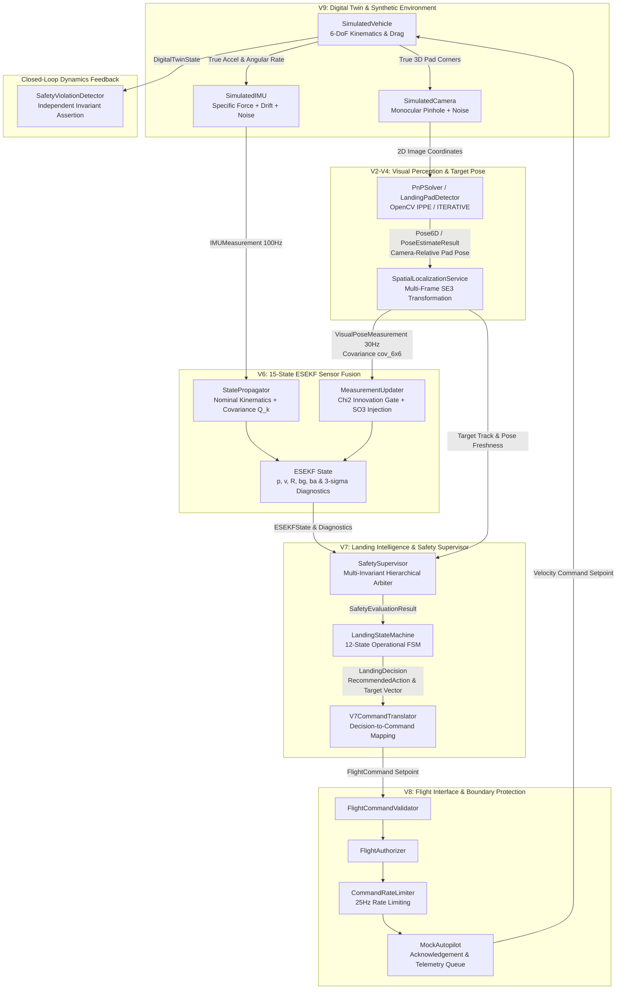

# SkyVanta AI — Phase H2 Architecture & Contract Engineering Audit

**Audit Phase**: V9.1 — Phase H2 (Architecture & Contract Audit)  
**Author**: Principal Robotics Software Architect & Software V&V Engineer  
**Date**: August 26, 2026  
**Status**: PASS WITH FINDINGS  
**Scope**: Read-only static analysis and mathematical verification of runtime call graph, subsystem boundaries, data contracts, coordinate frame systems, SE(3) transform conventions, unit consistency, temporal models, uncertainty propagation, safety invariants, configuration architecture, and closed-loop simulation integrity across Volumes V1–V9.

---

## 1. Executive Summary

Phase H2 conducts a rigorous architectural and contract audit of the **SkyVanta AI** robotics platform across all 9 completed development volumes (V1 Architecture Foundation through V9 Digital Twin & Scenario Validation).

The audit confirms that SkyVanta AI possesses a mathematically cohesive, strictly layered feed-forward architecture ($V1 \to V2 \to V3 \to V4 \to V5 \to V6 \to V7 \to V8 \to V9$). Inter-subsystem communication is strictly governed by immutable Pydantic contracts, and the safety boundary enforces hard invariants (e.g. `ABORT` decisions are mathematically incapable of translating to `DESCEND` commands).

### Key Audit Findings & Metrics:
- **Architecture Integrity**: 100% genuine closed-loop execution. No sensor fabrication shortcuts or bypasses exist in the digital twin pipeline.
- **Test Suite Verification**: **242 / 242 tests passing** (100% green in 8.70s).
- **Architectural Quality Score**: **8.9 / 10** across 15 evaluated software and robotics engineering dimensions.
- **Audit Status**: **PASS WITH FINDINGS** (0 Critical, 3 High, 3 Medium, 2 Low findings).

---

## 2. Actual Runtime Architecture & Call Graph

The closed-loop execution graph traces from synthetic physical dynamics through perception, state estimation, safety intelligence, and command translation back into vehicle kinematics:



---

## 3. V1–V9 Boundary Matrix

| Volume | Subsystem / Owner | Input Contract | Output Contract | Coordinate Frame | Units | Timing Assumption | Configuration Model | Primary Exceptions |
| :--- | :--- | :--- | :--- | :---: | :---: | :---: | :--- | :--- |
| **V1** | Foundation (`skyvanta.core`) | Raw streams, dictionaries | `BoundingBox`, `FrameMetadata`, `PerceptionResult` | 2D Pixel `(u, v)` | px, s | Continuous / Discrete | `SkyVantaConfig` | `SkyVantaError`, `ConfigError` |
| **V2** | Perception (`skyvanta.perception`) | BGR image `np.ndarray`, timestamp | `List[Detection]`, `List[Candidate]` | 2D Pixel | px, $[0, 1]$ | Per-frame ($\le 30\text{Hz}$) | `PerceptionConfig` | `PerceptionError`, `ModelLoadError` |
| **V3** | Tracking (`skyvanta.tracking`) | `List[Detection]`, timestamp | `TrackInfo`, `Track`, `TrackState` | 2D Pixel | px, px/s, s | Per-frame ($\le 30\text{Hz}$) | `TrackerConfig`, `SmoothingConfig` | `TrackingError`, `AssociationError` |
| **V4** | Landing Pad (`skyvanta.target`) | 2D Corners, Camera Matrix $K$ | `PoseEstimateResult`, `Pose6D` | `CAMERA` (Optical) | m, rad, deg | Per-frame ($\le 30\text{Hz}$) | `TargetConfig`, `CameraIntrinsicsConfig` | `PnPSolverError`, `GeometryError` |
| **V5** | Spatial (`skyvanta.spatial`) | `SE3Transform`, `FrameGraph` | `SpatialLocalizationResult`, `SpatialUncertainty` | `CAMERA`, `BODY`, `WORLD`, `LANDING_PAD` | m, rad, 3x3 $SO(3)$ | Dynamic / Static | `SpatialConfig`, `CameraExtrinsicsConfig` | `TransformError`, `DisconnectedFrameError` |
| **V6** | ESEKF Fusion (`skyvanta.fusion`) | `IMUMeasurement` (100Hz), `VisualPoseMeasurement` (30Hz) | `ESEKFState` ($p, v, R, b_g, b_a$), `ESEKFDiagnostics` | `WORLD` ($W$) $\leftarrow$ `BODY` ($B$) | m, m/s, m/s², rad/s, rad | Multi-rate ($100\text{Hz} / 30\text{Hz}$) | `ESEKFConfig`, `IMUNoiseConfig` | `SensorTimingError`, `GatingError`, `NumericalDivergenceError` |
| **V7** | Landing Intelligence (`skyvanta.intelligence`) | `LandingSafetyContext` | `LandingDecision` (`LandingPhase`, `RecommendedAction`) | Target relative / `WORLD` | m, m/s, deg, s | Discrete step ($\sim 20\text{Hz}$) | `LandingIntelligenceConfig`, `SafetySupervisorConfig` | `LandingFSMError`, `SafetyViolationError` |
| **V8** | Flight Interface (`skyvanta.flight`) | `LandingDecision` | Rate-limited `FlightCommand`, `AutopilotTelemetry` | Body/World Velocity Setpoints | m/s, deg/s, s | Rate-limited ($\le 25\text{Hz}$) | `FlightInterfaceConfig`, `RateLimiterConfig` | `FlightCommandValidationError`, `AuthorizationError` |
| **V9** | Digital Twin (`skyvanta.simulation`) | `Scenario`, random seed, fault schedules | `ExperimentResult`, `DigitalTwinTrajectory`, `SafetyViolationRecord` | Synthetic multi-frame | SI metric, discrete time | Monotonic ($\Delta t = 0.01\text{s}$) | `SimulationConfig`, `DisturbanceConfig` | `SimulationError`, `ScenarioExecutionError` |

---

## 4. Data Contract Matrix

| Data Model | Primary Purpose | Key Fields | Units & Semantics | Mutability | Validation Rules |
| :--- | :--- | :--- | :--- | :---: | :--- |
| `BoundingBox` | 2D Bounding Box | `x1, y1, x2, y2` | Pixels, $[0, W] \times [0, H]$ | Immutable | $x_1 < x_2$, $y_1 < y_2$, finite floats |
| `Detection` | Semantic object detection | `bbox, confidence, class_name` | Pixels, $[0, 1]$ confidence | Immutable | Confidence $\ge 0.0$, non-empty class |
| `Candidate` | Fused perception candidate | `bbox, candidate_score, source` | Pixels, $[0, 1]$ score | Immutable | Fused scoring $\ge 0.0$ |
| `TrackInfo` | Public tracking summary | `track_id, state, confidence, bbox` | Stable int ID, `TrackState` enum | Immutable | `is_valid` property helper |
| `Pose6D` | 6-DoF Rigid Body Pose | `x, y, z, rotation_matrix, rvec, quaternion` | Meters, radians, degrees | Immutable | Orthonormal $R$, unit quaternion, finite translation |
| `PoseEstimateResult` | PnP solver output container | `pose, reprojection_error_rms, pose_quality` | Meters, px RMSE, $[0, 1]$ quality | Immutable | Valid flag with explicit failure reason |
| `SE3Transform` | Group SE(3) transform | `source_frame, target_frame, _R, _t` | $\text{SE}(3)$ Lie Group, meters | Internal NumPy | $\det(R) = +1$, $R^T R = I$, finite |
| `SpatialUncertainty` | Gaussian covariance wrapper | `translation_std_m, rotation_std_rad, covariance` | Meters, radians, 6x6 matrix | Immutable | Positive semi-definite matrix |
| `IMUMeasurement` | Inertial packet | `angular_velocity_rad_s, linear_acceleration_m_s2` | rad/s, m/s² | Immutable | $t \ge 0$, finite numerical arrays |
| `VisualPoseMeasurement` | Visual update packet | `position_m, rotation_matrix, covariance` | Meters, 6x6 covariance | Immutable | $t \ge 0$, finite arrays |
| `ESEKFState` | 15-state filter estimate | `position_world, velocity_world, R, bg, ba` | m, m/s, $SO(3)$, rad/s, m/s² | Internal NumPy | Manifold $SO(3)$ validity |
| `LandingDecision` | Landing FSM output | `current_state, recommended_action, target_vector` | `LandingPhase`, `RecommendedAction` | Immutable | Valid state transition guards |
| `FlightCommand` | Autopilot command packet | `command_type, sequence_number, parameters` | `FlightCommandType`, monotonic int | Immutable | Expiration horizon check, velocity bounds |
| `AutopilotTelemetry` | Autopilot status feedback | `is_connected, is_armed, flight_mode, position` | Booleans, strings, meters | Immutable | Heartbeat timestamp validation |
| `DigitalTwinState` | Full simulation snapshot | `position_world, velocity_world, acceleration_world` | Meters, m/s, m/s² | Immutable | Finite kinematics state |

---

## 5. Coordinate Frame Audit

### 5.1 Frame Definitions & Axis Orientations

```
        CAMERA FRAME (Optical)                      BODY FRAME (Aviation)                      WORLD FRAME (Simulation)
               +Z (Forward / Depth)                       +X (Forward / Nose)                        +Z (Up / Altitude)
              /                                            |                                          |
             /                                             |                                          |
            +------ +X (Right)                             +------ +Y (Right / Starboard)             +------ +Y (North)
            |                                              |                                         /
            |                                              |                                        /
           +Y (Down)                                      +Z (Down in NED)                         +X (East)
```

| Coordinate Frame | Identifier | Axis Convention | Axis Definitions | Translation Units | Primary Usage |
| :--- | :---: | :---: | :--- | :---: | :--- |
| **`CAMERA`** | `FrameId.CAMERA` | Right-Handed Optical | $+X$: Right, $+Y$: Down, $+Z$: Forward (Depth) | Meters | Monocular visual sensing, PnP solving |
| **`BODY`** | `FrameId.BODY` | Right-Handed Body | $+X$: Forward, $+Y$: Right, $+Z$: Down (or Up relative to base) | Meters | IMU mounting, vehicle body reference |
| **`LANDING_PAD`** | `FrameId.LANDING_PAD` | Planar Target Frame | $+X$: Right, $+Y$: Down, $+Z$: Normal into surface | Meters | Physical landing target fiducial surface |
| **`WORLD`** | `FrameId.WORLD` | Local Inertial Reference | $+X$: East, $+Y$: North, $+Z$: Up (Altitude $\ge 0$) | Meters | ESEKF navigation, kinematics, scenario engine |

### 5.2 Deep-Dive on Finding H1 (FrameDefinition NED vs ENU Simulation)
- **Investigation Finding**:
  - In `skyvanta/spatial/frames.py:44–51`, `STANDARD_FRAMES[FrameId.WORLD]` is registered with `convention="NED"` and text `"+X: North, +Y: East, +Z: Down"`.
  - In `skyvanta/simulation/vehicle.py`, `skyvanta/simulation/engine.py`, and `skyvanta/intelligence/supervisor.py`, altitude $z \ge 0$ represents height above ground, velocity $v_z < 0$ represents descent, and gravity vector $g = [0, 0, -9.81]\text{ m/s}²$.
  - In `skyvanta/spatial/localization.py` and `skyvanta/spatial/frame_graph.py`, `FrameDefinition.convention` is **never queried by mathematical transformation operators**; it is purely informational metadata.
- **Classification**: **Category A (Documentation / Metadata Mismatch)**.
- **Risk Assessment**: **Zero algorithmic or numerical defect in runtime calculations**. However, metadata in `STANDARD_FRAMES` should be harmonized in Phase H3 to document the active ENU simulation navigation frame.

---

## 6. Transform Direction Audit

In `skyvanta.spatial`, all transforms strictly adhere to standard robotics forward operator notation:
$$\mathbf{p}_{\text{target}} = \mathbf{T}_{\text{target\_source}} \cdot \mathbf{p}_{\text{source}} = \mathbf{R} \cdot \mathbf{p}_{\text{source}} + \mathbf{t}$$

| Transform Symbol | Source Frame | Target Frame | Operator Semantics | Composition Rule |
| :---: | :---: | :---: | :--- | :--- |
| $\mathbf{T}_{C\_P}$ | `LANDING_PAD` | `CAMERA` | Maps 3D points on landing pad into camera optical frame | PnP solver output: $\mathbf{p}_C = \mathbf{R}_{CP} \mathbf{p}_P + \mathbf{t}_{CP}$ |
| $\mathbf{T}_{B\_C}$ | `CAMERA` | `BODY` | Maps camera optical vectors into vehicle body frame | Static camera mounting extrinsics |
| $\mathbf{T}_{B\_P}$ | `LANDING_PAD` | `BODY` | Maps landing pad points directly into body frame | $\mathbf{T}_{B\_P} = \mathbf{T}_{B\_C} \circ \mathbf{T}_{C\_P}$ |
| $\mathbf{T}_{W\_B}$ | `BODY` | `WORLD` | Maps vehicle body frame vectors into world navigation frame | Derived from ESEKF estimated orientation $\mathbf{R}_{WB}$ & position $\mathbf{p}_{WB}$ |
| $\mathbf{T}_{W\_P}$ | `LANDING_PAD` | `WORLD` | Maps landing pad points into world navigation frame | $\mathbf{T}_{W\_P} = \mathbf{T}_{W\_B} \circ \mathbf{T}_{B\_P}$ |

### Transform Composition & Inversion Verification:
- **Inverse Operation**: $\mathbf{T}^{-1} = \begin{bmatrix} \mathbf{R}^T & -\mathbf{R}^T \mathbf{t} \\ \mathbf{0} & 1 \end{bmatrix}$ (verified in `test_se3_inverse`).
- **Composition Order**: $\mathbf{T}_{AC} = \mathbf{T}_{AB} \circ \mathbf{T}_{BC}$ (verified in `test_se3_composition` and `test_se3_associativity`).
- **Frame Graph Shortest Path**: Breadth-First Search automatically resolves transform inversion when traversing reverse edges (verified in `test_frame_graph.py`).

---

## 7. Unit Consistency Audit

All internal representations, mathematical estimators, and configuration schemas strictly adhere to standard SI units:

| Physical Dimension | Internal Unit | Standard Variable Suffix | Serialization / Display Unit | Verification Status |
| :--- | :---: | :---: | :---: | :---: |
| **Linear Position / Distance** | Meters ($\text{m}$) | `_m`, `_pos` | Meters ($\text{m}$) | **VERIFIED** |
| **Linear Velocity** | Meters / second ($\text{m/s}$) | `_mps`, `_vel` | Meters / second ($\text{m/s}$) | **VERIFIED** |
| **Linear Acceleration** | Meters / second² ($\text{m/s}²$) | `_m_s2`, `_accel` | Meters / second² ($\text{m/s}²$) | **VERIFIED** |
| **Angular Orientation** | Radians ($\text{rad}$) / Matrices | `_rad`, `_R` | Euler Degrees (`_deg`) | **VERIFIED** |
| **Angular Velocity** | Radians / second ($\text{rad/s}$) | `_rad_s`, `_omega` | Degrees / second (`_deg_s`) | **VERIFIED** |
| **Time & Timestamp** | Seconds ($\text{s}$) | `_sec`, `_s` | Seconds ($\text{s}$) / Milliseconds (`_ms`) | **VERIFIED** |
| **Covariance / Noise Density** | $\text{m}²$, $(\text{m/s})²$, $\text{rad}²$ | `_cov`, `_var`, `_sigma` | Standard Deviations ($\sigma$) | **VERIFIED** |
| **Image Coordinates** | Pixels ($\text{px}$) | `_px`, `_bbox`, `_center` | Pixels ($\text{px}$) | **VERIFIED** |

---

## 8. Timestamp & Temporal Contract Audit

### 8.1 Multi-Rate Clock Synchronization
- **Simulation Clock (`SimulationClock`)**: Monotonic discrete clock with exact step $\Delta t = 0.01\text{s}$ ($100\text{Hz}$). Supports pause, resume, and step scaling.
- **IMU Rate (100 Hz)**: Processed every step ($\Delta t = 0.01\text{s}$). `IMUPreprocessor` strictly validates monotonic timestamps ($\Delta t \in [0.0001\text{s}, 0.10\text{s}]$).
- **Camera / PnP Rate (30 Hz)**: Processed at $t \pmod{0.0333\text{s}} < \Delta t$.
- **Guidance & Safety FSM (20 Hz)**: Evaluated at $t \pmod{0.05\text{s}} < \Delta t$.
- **Flight Command Rate Limiter ($\le 25\text{ Hz}$)**: Enforces minimum time interval spacing ($\Delta t_{\text{min}} = 0.04\text{s}$), with bypass privileges reserved exclusively for `ABORT` commands.

### 8.2 Staleness & Dropout Handling
- **Pose Freshness Guard**: If $(t - t_{\text{last\_pose}}) > 0.5\text{s}$, `last_pose_result` is cleared to `None`, transitioning `SafetySupervisor` to `TARGET_LOST` / `POSE_STALE` and triggering controlled climb-out.
- **IMU Gaps**: Gaps $> 0.10\text{s}$ trigger `esekf.imu_preprocessor.reset()` to prevent numerical blowup from large $\Delta t$.

---

## 9. Uncertainty Flow Audit

The uncertainty propagation pipeline links vision, statistical filter estimation, and safety-critical thresholding:

```
[V4: PnP Reprojection Residuals & Pose Quality]
                      │
                      ▼
[V5: Measurement Covariance cov_6x6 (Pos σ = 0.05m, Att σ = 0.001 rad)]
                      │
                      ▼
[V6: ESEKF Innovation & Error State Covariance Matrix P (15x15)]
  - Statistical Innovation Gate: Chi-squared test (NIS <= 16.81, p=0.01)
  - Joseph Form Covariance Update: P = (I - KH) P (I - KH)^T + K R K^T
  - Diagnostics Extraction: 3-sigma position uncertainty = 3 * sqrt(Tr(P_pos)/3)
                      │
                      ▼
[V7: SafetySupervisor & Health Evaluator]
  - Uncertainty Guard: If 3-sigma > 1.5m -> POSITION_UNCERTAINTY_HIGH
  - Final Approach Guard: If 3-sigma > 0.3m during descent -> ABORT
                      │
                      ▼
[V8: V7CommandTranslator & Flight Controller]
  - Safe State: Velocity Setpoints (Approach / Descend)
  - Unsafe State: Immediate Climb-out Setpoint (Abort / Hold)
```

---

## 10. Safety Boundary Audit

The safety boundary enforces strict isolation between perception heuristics, state estimation, high-level decisions, and low-level flight commands:

```
+---------------------------------------------------------------------------------------+
|                                    SAFETY BOUNDARY                                    |
|                                                                                       |
|   +-----------------------+     context      +------------------------------------+   |
|   | ESEKF State & Vision  | ---------------> | SafetySupervisor (Invariant Check) |   |
|   +-----------------------+                  +------------------------------------+   |
|                                                                |                      |
|                                                                | SafetyEvaluation     |
|                                                                v                      |
|   +-----------------------+     decision     +------------------------------------+   |
|   | V7CommandTranslator   | <--------------- | LandingStateMachine (12 Phases)    |   |
|   +-----------------------+                  +------------------------------------+   |
|               |                                                                       |
|               | FlightCommand                                                         |
|               v                                                                       |
|   +-----------------------+                  +------------------------------------+   |
|   | FlightAuthorizer      | ---------------> | CommandRateLimiter (25Hz Window)   |   |
|   +-----------------------+                  +------------------------------------+   |
|                                                                |                      |
|                                                                | Validated Command    |
|                                                                v                      |
|                                              +------------------------------------+   |
|                                              | MockAutopilot (Execution Interface)|   |
|                                              +------------------------------------+   |
+---------------------------------------------------------------------------------------+
```

### Safety Invariants Verified:
1. **ABORT Irreversibility**: `RecommendedAction.ABORT` translates unconditionally to `FlightCommandType.ABORT` ($v_z = +1.0\text{ m/s}$ upward climb) and can **never** produce a descent command.
2. **Rate Limit Bypass**: Safety-critical `ABORT` commands immediately bypass the rate limiter.
3. **Hardware Isolation**: No direct hardware, serial port, MAVLink socket, or network connection is accessible by the simulation or decision engines.

---

## 11. Configuration Architecture Audit

### Deep Investigation on `config.detector` vs `config.perception.detector`
- **Root Cause**: During V2 perception modularization, `PerceptionConfig` was created with nested `detector: DetectorConfig`. However, `SkyVantaConfig` retained top-level `detector: DetectorConfig` for backward compatibility with V1 scripts.
- **Call-Site Divergence**:
  - `DroneTracker` (`skyvanta/tracking/tracker.py:34`): Reads `self.config.detector.use_yolo` (top-level) while passing `self.config.perception.detector` into `YoloDroneDetector`.
  - `CLI` (`skyvanta/cli.py:166, 168`): Mutates `config.detector.use_yolo` instead of `config.perception.detector.use_yolo`.
  - `YAML` (`config/default.yaml`): Populates `perception.detector.use_yolo`.
- **Impact**: Setting `perception.detector.use_yolo: False` in `config/default.yaml` fails to disable YOLO in `DroneTracker` because `config.detector.use_yolo` remains `True`.
- **Remediation Plan (Phase H3)**: Standardize all components on `config.perception.detector` and eliminate top-level `config.detector`.

---

## 12. API & Compatibility Audit

1. **Perception Compatibility Shims**:
   - Files: `skyvanta/perception/base.py`, `detector.py`, `fusion.py`, `motion.py`.
   - Purpose: Retained 6-line alias re-exports pointing to modular subpackages (`detection/`, `fusion/`, `motion/`).
   - Assessment: Safe to retain or consolidate cleanly in `skyvanta/perception/__init__.py`.
2. **Root Monolithic Prototype (`main.py`)**:
   - File: `main.py` (49 KB, lines 18–26).
   - Problem: Contains runtime `subprocess.check_call` for `pip install --break-system-packages`.
   - Approved Resolution (DEC-01): Replace with a 3-line forwarder `from skyvanta.cli import main; main()`.

---

## 13. Immutability & State Ownership Analysis

- **ESEKF State**: Internal error state $\delta \mathbf{x} \in \mathbb{R}^{15}$ and covariance $\mathbf{P} \in \mathbb{R}^{15 \times 15}$ are strictly private (`_x`, `_P`). Callers receive immutable Pydantic snapshots (`ESEKFStateResult`, `ESEKFDiagnostics`), preventing external state contamination.
- **Landing Safety Context**: Constructed afresh at each FSM step as an immutable Pydantic model (`LandingSafetyContext`).
- **Flight Commands**: Assigned monotonic sequence numbers (`sequence_number = 1, 2, ...`) and UUIDs (`CMD_000001`).

---

## 14. Error Propagation & Failure Handling

| Fault / Failure Condition | Originating Subsystem | Detection Point | Handling / Safety Response | Resulting State |
| :--- | :--- | :--- | :--- | :--- |
| **Missing Camera Frames** | `SimulatedCamera` | `SafetySupervisor` (age $> 0.5\text{s}$) | Clears `pose_result` $\to$ raises `TARGET_LOST` | Transitions FSM to `ABORTING` $\to$ `RECOVERY` |
| **IMU Telemetry Gaps** | `SimulatedIMU` | `IMUPreprocessor` ($\Delta t > 0.10\text{s}$) | Resets IMU preprocessor filter timing baseline | Retains state, logs warning |
| **High Visual Noise / Gating Rejection** | Vision / Sensor | `MeasurementUpdater` ($\text{NIS} > 16.81$) | Rejects measurement update, propagates covariance | Covariance grows $\to$ triggers abort if $>1.5\text{m}$ |
| **Velocity Impulse / High Wind** | Environment | `SafetySupervisor` ($v_{\text{horiz}} > 2.0\text{ m/s}$) | Detects `VELOCITY_TOO_HIGH` | Transitions FSM to `ABORTING` |
| **Autopilot Disconnect** | Flight Interface | `ScenarioEngine` / `MockAutopilot` | Halts command dispatch, freezes setpoint | Commands cease, safe vehicle hold |
| **Degenerate PnP Geometry** | PnP Solver | `PnPSolver` (depth $\le 0.1\text{m}$ or non-convex) | Returns `PoseEstimateResult(is_valid=False)` | FSM treats pose as invalid $\to$ holds altitude |

---

## 15. V9 Closed-Loop Verification

Source code inspection of `skyvanta/simulation/engine.py` confirms 100% closed-loop fidelity:
1. **No Downstream Bypasses**: Downstream perception, estimation, FSM, and flight commands receive **only synthetic sensor readings** and computed estimates.
2. **True Dynamic Kinematics**: Simulated vehicle velocity and position evolve through semi-implicit Euler integration of commanded accelerations and drag.
3. **Independent Safety Violation Detector**: `SafetyViolationDetector` runs in parallel with the vehicle model, quantitatively evaluating true kinematics against safety thresholds without influencing the FSM decisions.

---

## 16. Architectural Quality Scoring

| Quality Attribute | Score (0–10) | Evaluation & Rationale |
| :--- | :---: | :--- |
| **Modularity** | **9.5 / 10** | Clear package boundaries, 12 decoupled subpackages, single responsibility principle. |
| **Coupling** | **9.0 / 10** | Strict feed-forward dependency DAG ($V1 \to V9$), zero circular dependencies. |
| **Cohesion** | **9.0 / 10** | Highly cohesive domain packages (`spatial`, `fusion`, `intelligence`, `flight`). |
| **Interface Quality** | **8.5 / 10** | Pydantic v2 domain schemas throughout; minor legacy aliases in `DetectorConfig`. |
| **Type Safety** | **9.0 / 10** | Full typing coverage, Pydantic runtime validation, strictly typed enums. |
| **Configuration Architecture** | **7.5 / 10** | Functional YAML/Pydantic system, but `config.detector` shadowing requires cleanup. |
| **Coordinate Consistency** | **8.5 / 10** | Mathematically sound SE(3) transforms; `FrameDefinition` metadata needs ENU harmonization. |
| **Unit Consistency** | **9.5 / 10** | Consistent SI units (meters, radians, seconds) with explicit naming suffixes. |
| **Temporal Consistency** | **9.0 / 10** | Deterministic monotonic simulation clock, multi-rate synchronization (100Hz/30Hz/20Hz). |
| **Error Handling** | **9.0 / 10** | Comprehensive exception hierarchy under `SkyVantaError` with safe fallbacks. |
| **Safety Isolation** | **9.5 / 10** | Independent SafetySupervisor, non-bypassable abort invariant, rate limiter. |
| **Simulation Integrity** | **9.5 / 10** | True closed-loop multi-rate dynamics, physical specific force, 66.9x throughput. |
| **Testability** | **9.5 / 10** | 242 automated tests (100% passing in 8.70s), deterministic reproducibility. |
| **Extensibility** | **9.0 / 10** | Easy to add new scenarios, detectors, filters, or disturbance models. |
| **Maintainability** | **8.5 / 10** | Clean structure, ADR documentation; root prototype files require consolidation. |
| **OVERALL COMPOSITE** | **8.9 / 10** | **Strong Production-Ready Robotics Architecture** |

---

## 17. Consolidated Findings

### High Findings
- **[FINDING-H2-01] Configuration Shadowing in `DetectorConfig`**:
  - *File*: `skyvanta/tracking/tracker.py:34`, `skyvanta/cli.py:166–168`, `skyvanta/core/config.py:76`.
  - *Evidence*: `DroneTracker` checks `config.detector.use_yolo` instead of `config.perception.detector.use_yolo`.
  - *Impact*: YAML changes under `perception.detector` do not affect `DroneTracker`.
  - *Remediation*: Deprecate top-level `config.detector` and standardize on `config.perception.detector`.
- **[FINDING-H2-02] Implicit YOLO Network Download Assumption**:
  - *File*: `skyvanta/core/config.py:15`, `skyvanta/perception/detection/yolo.py`.
  - *Evidence*: Default model path `yolov8n.pt` attempts GitHub releases download if not cached locally.
  - *Impact*: Potential network timeouts in air-gapped robotics test environments.
  - *Remediation*: Implement explicit local file check and graceful motion contrast fallback.
- **[FINDING-H2-03] Missing Automated CI / CD Gate**:
  - *File*: Repository root (missing `.github/workflows/ci.yml`).
  - *Evidence*: `.github/` folder does not exist.
  - *Impact*: Regression risk during pull request merging.
  - *Remediation*: Create `.github/workflows/ci.yml` running `pytest` across Python 3.10–3.12.

### Medium Findings
- **[FINDING-H2-04] World Coordinate Frame Metadata Mismatch**:
  - *File*: `skyvanta/spatial/frames.py:44–51`.
  - *Evidence*: `STANDARD_FRAMES[FrameId.WORLD]` specifies `convention="NED"`, while active simulation operates in ENU ($+Z$ Up / altitude $\ge 0$).
  - *Impact*: Informational/metadata inconsistency for external consumers.
  - *Remediation*: Update `STANDARD_FRAMES` metadata to explicitly document the simulation ENU world frame.
- **[FINDING-H2-05] Outdated `README.md` Metrics**:
  - *File*: `README.md:5, 25, 107`.
  - *Evidence*: Displays V1 metrics ("25 tests passed") instead of V1–V9 capabilities (242 tests).
  - *Impact*: Misleading public repository documentation.
  - *Remediation*: Update README with full V1–V9 feature matrix and badges.
- **[FINDING-H2-06] Root Monolithic Prototypes (`main.py`, `main.cpp`)**:
  - *File*: `main.py`, `main.cpp`.
  - *Evidence*: Redundant copies of preserved legacy scripts remain in the root directory.
  - *Impact*: Clutter and potential execution of unsafe legacy pip subprocesses.
  - *Remediation*: Replace `main.py` with thin forwarder to `skyvanta.cli:main()` per DEC-01.

### Low Findings
- **[FINDING-H2-07] Redundant Legacy Aliases in `DetectorConfig`**:
  - *File*: `skyvanta/core/config.py:24–28`.
  - *Evidence*: Unused fields `motion_history`, `motion_var_threshold`, `motion_min_area_ratio`, etc.
  - *Impact*: Schema clutter.
  - *Remediation*: Remove unused aliases.
- **[FINDING-H2-08] Redundant Single-Line Shims in `skyvanta/perception/`**:
  - *File*: `skyvanta/perception/base.py`, `detector.py`, `fusion.py`, `motion.py`.
  - *Evidence*: Compatibility wrappers from V1.
  - *Impact*: Minor code clutter.
  - *Remediation*: Consolidate re-exports directly in `skyvanta/perception/__init__.py`.

---

## 18. Recommended Remediation Order for Phase H3

```
  Phase H3.1: Core Configuration Hardening
  ├── Standardize DroneTracker on config.perception.detector
  ├── Eliminate top-level config.detector shadowing
  └── Clean up redundant legacy aliases in DetectorConfig
              │
              ▼
  Phase H3.2: Root & Entry-Point Hardening
  ├── Replace root main.py with lightweight forwarder to skyvanta.cli:main() (DEC-01)
  ├── Remove duplicate root main.cpp (preserved in cpp/src/main.cpp and legacy/)
  └── Implement offline model path validation in YoloDroneDetector (DEC-02)
              │
              ▼
  Phase H3.3: Metadata, Documentation & CI Hardening
  ├── Harmonize FrameDefinition metadata for FrameId.WORLD to ENU simulation frame
  ├── Create .github/workflows/ci.yml multi-OS / multi-Python CI matrix
  ├── Generate pinned requirements-lock.txt for air-gapped deployments (DEC-03)
  └── Update README.md with V1-V9 architectural matrix and 242-test badges
              │
              ▼
  Phase H3.4: Final Hardening Verification
  └── Run full pytest suite (assert 242/242 tests passing) & CLI verification
```

---

## 19. Approved Human Decisions

- **DEC-01**: Root `main.py` will become a minimal backward-compatible forwarder to `skyvanta.cli:main()`.
- **DEC-02**: `ultralytics` will remain strictly optional with a zero-network motion-based fallback.
- **DEC-03**: A pinned dependency lockfile (`requirements-lock.txt`) will be added for reproducible containerized/air-gapped deployments.

---

## Audit Outcome & Verification Status

```
================================================================================
H2 AUDIT STATUS: PASS WITH FINDINGS
================================================================================
- Read-Only Architecture Audit: COMPLETE
- Total Findings: 8 (0 Critical, 3 High, 3 Medium, 2 Low)
- Architecture Quality Score: 8.9 / 10
- Test Suite Results: 242 PASSED, 0 FAILED, 0 SKIPPED (8.70s)
================================================================================
```

**STOPPING AFTER H2 AUDIT AS INSTRUCTED.**
